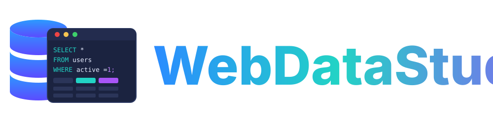

<p align="center">
  
</p>

<p align="center">
  A database studio that runs in your browser. One container, nine engines, no install.
</p>

<p align="center">
  <a href="https://fgilde.github.io/WebDataStudio/">Documentation</a> ·
  <a href="https://fgilde.github.io/WebDataStudio/#/de/">Dokumentation (Deutsch)</a> ·
  <a href="https://github.com/fgilde/WebDataStudio/pkgs/container/webdatastudio">Container image</a>
</p>

---

## Run it

```bash
docker run -d -p 8080:8080 -v wds-data:/data \
  -e WDS_CONN_LOCAL="postgres://app:pw@db:5432/shop" \
  ghcr.io/fgilde/webdatastudio
```

Open <http://localhost:8080>. Without `WDS_USER` and `WDS_PASSWORD` there is **no login screen** —
the app opens straight into the studio.

### In .NET Aspire

```csharp
var db = builder.AddPostgres("db").AddDatabase("shop");

builder.AddContainer("studio", "ghcr.io/fgilde/webdatastudio")
       .WithHttpEndpoint(port: 8080, targetPort: 8080)
       .WithEnvironment("WDS_CONN_SHOP", db.Resource.ConnectionStringExpression)
       .WithVolume("wds-data", "/data");
```

Every connection string you can express as an environment variable is attached at startup, so a
studio for your development stack is one resource in the app host.

Or with [Nextended.Aspire.Hosting.WebDataStudio](https://www.nuget.org/packages/Nextended.Aspire.Hosting.WebDataStudio/),
which wires the databases of your stack into the studio for you:

```csharp
builder.AddPostgres("pg").AddDatabase("shop").WithWebDataStudio();
builder.AddSqlServer("sql").AddDatabase("orders").WithWebDataStudio();
```

Both databases land in one studio; a second `studioName` gives you a second studio.

## Engines

PostgreSQL · MySQL and MariaDB · Microsoft SQL Server · SQLite · Oracle · DuckDB · ClickHouse ·
MongoDB · Redis

Each driver declares what it can do, and the UI hides what an engine does not support instead of
offering a button that fails.

## What it does

- **Query editor** — Monaco with dialect-aware highlighting, schema-aware completion, formatting,
  the statement under the cursor highlighted, run selection with F5, bind parameters, snippets,
  saved queries with folders, and history that survives a restart.
- **Results** — a virtualised grid for hundreds of thousands of rows, per-column filters, grouping,
  a form view, a transposed view, charts, and a comparison between two results.
- **Editing** — spreadsheet-style cell editing with a change-script preview before anything runs,
  foreign-key lookups, bulk updates, insert and delete.
- **Export and import** — CSV, TSV, Excel, JSON, NDJSON, XML, YAML, Markdown, HTML, SQL inserts,
  SQL schema and Parquet, streamed rather than buffered; import from CSV, Excel, JSON and SQL with
  a column mapping; table-to-table copy across engines.
- **Schema** — a table designer, index and constraint management, view, procedure and trigger
  editing, and a migration script preview for every change.
- **Analysis** — estimated and actual execution plans with a cost heat map, an index advisor that
  writes the `CREATE INDEX` for you, a deep analyze for missing, unused and duplicate indexes,
  table statistics, slow queries and server metrics.
- **Comparison** — schema and data diffs between two connections, with a sync script in a diff
  editor.
- **Administration** — maintenance commands, sessions, databases, users and privileges, server
  logs, and backup and restore through the engines' own tools.
- **Diagrams** — an ER diagram per schema with automatic layout, a table picker, and PNG and SVG
  export.
- **The shell** — a command palette on Ctrl+K, keyboard shortcuts with a help overlay, dockable
  panels, saved layout presets, deep links to an object, and 21 themes.

[`docs/features.md`](docs/features.md) lists every feature with its status and the engines it
applies to; a test fails the build if that list falls behind.

## Environment variables

| Variable | Meaning |
|---|---|
| `WDS_CONNECTIONS` | JSON array of connection objects, applied at startup |
| `WDS_CONN_<NAME>` | one connection as a URL, e.g. `postgres://user:pw@host:5432/db`, or a provider connection string |
| `WDS_CONN_<NAME>_ENGINE` | the engine for a `WDS_CONN_<NAME>` that holds a provider connection string instead of a URL |
| `WDS_CONN_<NAME>_READONLY`, `_GROUP`, `_COLOR` | per-connection flags for the variable of the same name |
| `WDS_USER`, `WDS_PASSWORD` | when **both** are set, a login screen guards the app; otherwise anonymous |
| `WDS_SECRET_KEY` | AES key (base64, 32 bytes) for stored connection secrets; generated into `/data/.key` if absent |
| `DB_PATH` | application SQLite database, default `/data/webdatastudio.db` |
| `WDS_QUERY_TIMEOUT_SECONDS` | default statement timeout, default 300 |
| `WDS_MAX_ROWS` | default fetch cap per result, default 1000 |
| `WDS_MAX_SESSIONS` | open sessions per connection, default 8 |
| `WDS_IDLE_TIMEOUT_SECONDS` | how long an unused session stays open, default 300 |
| `WDS_READONLY` | when `true`, every connection is read-only regardless of its own flag |
| `ASPNETCORE_URLS` | listen address, default `http://0.0.0.0:8080` |

`WDS_CONNECTIONS` entry shape:

```json
[{
  "name": "prod-pg",
  "engine": "postgresql",
  "connectionString": "Host=db;Port=5432;Database=shop;Username=app;Password=secret",
  "readOnly": true,
  "color": "#e03131",
  "group": "Production"
}]
```

URL schemes map to engines: `postgres`, `postgresql`, `mysql`, `mariadb`, `sqlserver`, `mssql`,
`sqlite`, `oracle`, `duckdb`, `clickhouse`, `mongodb`, `redis`.

A `WDS_CONN_<NAME>` may also carry the provider's own connection string — the form an orchestrator
already has. Say which engine it is:

```bash
WDS_CONN_SHOP="Host=db;Port=5432;Username=app;Password=pw;Database=shop"
WDS_CONN_SHOP_ENGINE=postgresql
```

Connections defined in the environment are re-read on every start, are read-only in the UI, and
carry a badge. Connections added in the UI live in `/data` with their passwords encrypted at rest.

## Desktop

Prefer a local binary to a container? Each release ships a self-contained build for Windows, macOS
and Linux that starts the same server and opens your browser:

```bash
./webdatastudio            # http://localhost:8080, opens a browser tab
```

Downloads are on the [releases page](https://github.com/fgilde/WebDataStudio/releases).

## Develop

```bash
# API on :5000
ASPNETCORE_URLS=http://localhost:5000 DB_PATH=/tmp/wds.db dotnet run --project src/WebDataStudio.Server

# SPA on :5173, proxying /api to :5000
cd web && npm install && npm run dev
```

Tests:

```bash
dotnet test                       # server, including live databases through Testcontainers
cd web && npx vitest run          # SPA units
cd web && npm run smoke           # browser check against a running server
```

## Licence

MIT.
