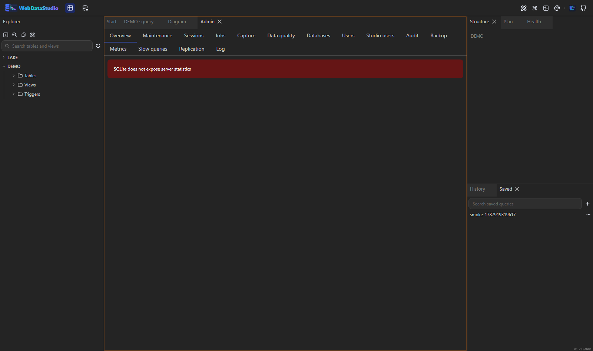
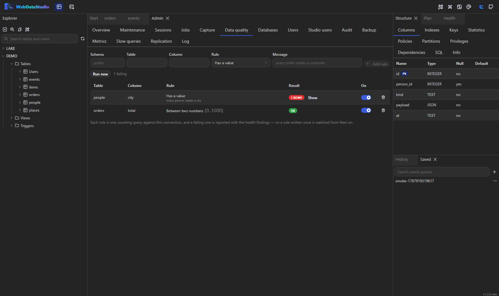
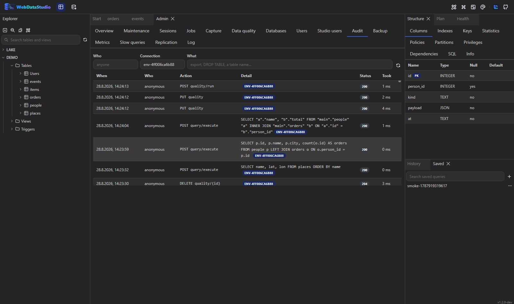
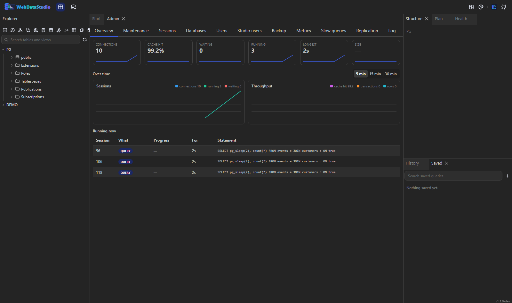

# Administration



## Maintenance

A catalogue of commands per engine: `VACUUM`, `ANALYZE`, `REINDEX` on PostgreSQL, `OPTIMIZE`,
`CHECK`, `FLUSH` on MySQL, `DBCC CHECKDB` and index rebuilds on SQL Server, and so on. The
destructive ones are marked and ask before they run.

The endpoint takes a command id from that catalogue, never raw SQL, and quotes the target through
the dialect — so this panel cannot become a second, unlogged query console.

## Jobs

What the server itself runs on a schedule, whatever it is called there: SQL Server Agent jobs,
pg_cron entries, MySQL events. One tab, because the question is the same — what runs, when, and did
it work. Each row carries the schedule, the outcome of the last run and the next run; clicking a job
opens its history.

Reading is free. Changing is not: **Enable**, **Disable** and **Run now** produce a statement in a
query tab, which then goes through the same run as anything typed by hand. pg_cron and MySQL have no
"run now" and say so rather than executing a job body behind your back.

An empty list is not a failure — pg_cron may not be installed, the Agent service may be off, the
event scheduler may be disabled — and the tab says which scheduler it looked in. An engine with no
scheduler of its own says that instead.

## Capture

"What runs on this server in the next minute." Pick a window, press **Capture**, and the studio reads
the server's own list of what it is doing once a second, grouping what it sees by statement with the
longest first — how often it was seen, who ran it, whether it was blocked.

This is sampling, not tracing: a statement that starts and finishes between two samples is not seen,
and the tab says so. Extended Events and its equivalents are the real answer to this question and
need permissions a studio has no business arranging. A capture can be stopped early and keeps what it
saw; one started before the panel was opened is picked up again.

**What should I change?** — asked once the capture has stopped, because advice about a minute that is
still being watched would keep moving. The twenty slowest statements are read by the same index
advisor the health report uses, and the suggestions are aggregated per table: how many statements
would benefit, how slow the slowest of them was, and the `CREATE INDEX` itself, which opens in a query
tab rather than running from here. Nothing to suggest is an answer too, and it says so.

## Data quality

The health report reads the catalogue: a table without a primary key, an index nobody uses. It cannot
say that a third of yesterday's orders have no customer, because that is not in the catalogue — it is
in the rows. The **Data quality** tab is the other half.

A rule is one counting query. Pick a table, a column and a kind:

| Rule | What it counts | Written as |
|---|---|---|
| Has a value | rows where the column is null | — |
| No duplicates | the extra rows in every group that appears more than once | — |
| Between two numbers | values outside the range | `0..100` |
| Points at a row that exists | values with no matching row in another table | `customers.id`, or `sales.customers.id` |
| Newest value is recent | one, if the newest value is older than that | `24h`, `30m`, `7d` |
| My own condition | rows that satisfy it | `total < 0 OR status = ''` |

The arguments are **parsed, not pasted**: a range is two numbers, a reference is a table and a column,
an interval is a number and a unit. An expression is the one exception — it is the person's own SQL
and is treated the way a query tab treats what somebody typed.

Two decisions worth knowing. `NULL` is not a broken reference: "no customer yet" is a different rule,
and *Has a value* is the one that catches it. And a rule that cannot be checked — a column that was
renamed — reports why rather than stopping the rules after it.

**Run now** runs every enabled rule and shows what each one counted, failing first, with the counting
statement one click away in a query tab. A rule can be switched off without being deleted.



A failing rule also becomes a **health finding**, which means the [alert webhook](#alerts) carries it:
a rule written once is watched from then on, without anybody opening the studio.

## Growth

The databases tab draws the sizes as a treemap, and underneath it the same tables ordered by *how much
they grew*. The sizes are sampled whenever somebody looks, so the history builds itself rather than
needing a decision to start it; the first look is a size, the second one is a growth.

Biggest absolute change first, with the percentage where it means anything — a table that started at
nothing has no meaningful percentage — and a per-day rate so a week and a month can be compared. A
table that shrank is marked differently from one that grew, because both are answers.

## Audit

Who did what through this studio: one line per request that changed something or took data out of the
building, with who asked, against which connection, and what came of it. Filter by person, by
connection, or by what happened — the search reads the statement as well as the action, so "who
dropped that" is a table name in the box.



It is described in full, with its variables, in [Safety](safety.md#who-did-what).

## Sessions

The session list shows who is connected, what they are running, how long it has taken and who is
blocking whom. A session can be terminated after a confirmation that shows its current statement.

## Databases

List, create and drop databases on the engines that have more than one. Dropping asks you to type
the name.

## Users and privileges

List the users, and create one or grant a privilege through the same preview-then-apply handshake
the rest of the app uses: the statement is shown, and only then does it run.

## Server log

Shown where the engine exposes it through SQL. Where it does not, the panel says which engine and
why instead of showing an empty box.

## Backup and restore

Backups run the engine's own tool — `pg_dump`, `mysqldump`, `mongodump`, `redis-cli --rdb` — and
stream the result straight to your browser. SQLite copies itself with `VACUUM INTO`; SQL Server
writes a `.bak` on the database server and reports the path.

Passwords are handed to those tools through the environment, never as a command-line argument that
every process on the machine could read.

Restore uploads a dump and asks you to type the target database's name first. It is the one action
in the app that overwrites a whole database.

### Options

On PostgreSQL the panel offers what `pg_dump` offers:

| Option | What it changes |
|---|---|
| Format | `plain` is replayable SQL, `custom` and `tar` are for `pg_restore` and can be restored selectively |
| Compression | 0 to 9; a compressed plain dump arrives as `.sql.gz` |
| No owner | leaves out the `OWNER TO` lines, which is what you want when restoring as somebody else |
| Include DROPs (clean) | prefixes the drops that make a plain dump replayable over an existing database |

The file is named after what it actually is — a custom dump is never called `.sql`, because that is
a file nobody can restore twice. "Clean" belongs to a plain dump: the other formats decide that at
restore time, and asking for it there is refused rather than quietly dropped. The other engines have
none of this, so their dialog does not offer it — and if an option reaches the server anyway it is
refused instead of ignored, because a file that does not match what was asked for is worse than an
error.

### Progress

A dump has no length up front: the tool is still running while the bytes arrive. The panel counts
what has arrived and says so next to the button, and the toast stays until it finishes.

If the tool fails part-way, the bytes already sent cannot be taken back — so a plain dump ends with
a comment saying which tool failed, after how many bytes, and why. That is exactly where somebody
restoring a truncated file will look.

## Overview

The first tab answers the question the other eight could only answer between them: connections,
cache hit ratio, how many sessions are waiting, how many statements are running, how long the
longest has been going, and the size of the database. Each tile keeps the last five minutes of
readings, so a number that is climbing looks different from one that is merely high.

### Over time



Under the tiles the same numbers are drawn as lines, over five, fifteen or thirty minutes — sessions
(connections, running, waiting) and throughput (cache hit, transactions, rows). Each line is
normalised to its own range: the point is the shape, and connections and a cache hit ratio share no
unit. The readings come from the same five-second poll as the tiles, so the graphs and the numbers
above them can never disagree. Half an hour is kept; nothing is stored on the server.

Below the tiles, everything the server is working on. PostgreSQL and SQL Server report a percentage
for a vacuum or an index build; MySQL and Oracle report the statement and its age, which is the
useful half. Nothing running says so instead of showing an empty table.

### Who is blocking whom

When sessions are waiting, the overview shows the chains rather than a list of waiters: the session
at the root is the one holding everything up, and it is the one with the kill button. Killing a
waiter frees nothing, so that button is only offered where it can help. A cycle — which SQL Server
does report — is shown once rather than followed round for ever.

## Replication

Replicas, their state and their lag, in bytes and in seconds where the engine reports both. A server
with no replicas says so, and so does one whose account cannot read the replication view — those are
different problems and it matters which one you have.

## Sizes

The databases tab draws the sizes as a treemap above the list. A hundred databases are one glance
here and a hundred lines to scroll in a table; the list is still underneath for the actions.

## Applying a recommendation

The health report names its fixes — `CREATE INDEX`, `DROP INDEX`, `VACUUM (ANALYZE)`. Each one has an
**Apply this…** button that runs it through the same preview-and-confirm path the table designer
uses: the script, whether it is destructive, and one place where it goes into the database. A
recommendation nobody can act on is a recommendation nobody acts on.

## Alerts

The studio runs the analysis behind its health report on a timer and posts what is **new** to a
webhook, so somebody hears about a missing index without opening the studio first.

| Variable | Meaning |
|---|---|
| `WDS_ALERT_WEBHOOK` | the URL to post to; without it nothing is watched |
| `WDS_ALERT_INTERVAL_MINUTES` | how often to look, default `60` |
| `WDS_ALERT_MIN_SEVERITY` | `info`, `warning` (default) or `critical` |
| `WDS_ALERT_CONNECTIONS` | connection names to watch, comma-separated. Empty means all |

```bash
WDS_ALERT_WEBHOOK=https://hooks.slack.com/services/…
WDS_ALERT_INTERVAL_MINUTES=120
```

The payload carries a `text` field — what Slack, Mattermost, Discord and Teams render — and the
findings themselves, each with the statement that would fix it:

```json
{
  "text": "*SHOP* — 2 new health findings\n• [warning] events has no primary key",
  "connection": { "id": "env-…", "name": "SHOP", "engine": "sqlite" },
  "findings": [{ "category": "no-primary-key", "severity": "warning", "title": "…", "fix": null }]
}
```

Only new findings are sent: the same warning every hour is a message people learn to ignore. A post
that fails is retried on the next sweep rather than swallowed, and a connection that cannot be
reached is a log line rather than an alert — whatever watches uptime already knows.

## Traces and metrics

With `OTEL_EXPORTER_OTLP_ENDPOINT` set — the standard variable, so a stack that already exports
telemetry needs nothing studio-specific — the studio reports its own work to that collector:

| What | Name |
|---|---|
| span per run | `query.execute`, tagged with the engine, the rows and whether it failed |
| span per tool call | `mcp.{tool}` |
| statements run | `wds.queries` (counter, tagged by engine and outcome) |
| how long they took | `wds.query.duration` (histogram, ms) |
| rows handed to a client | `wds.rows` (counter) |
| MCP tool calls | `wds.tool.calls` (counter, tagged by tool and outcome) |

ASP.NET Core, HttpClient and .NET runtime instrumentation ride along. Health checks are filtered out
of the traces — they would be most of the traffic and none of the information.

```bash
OTEL_EXPORTER_OTLP_ENDPOINT=http://collector:4317
OTEL_SERVICE_NAME=analytics-studio      # defaults to "webdatastudio"
```

Nothing is exported without that endpoint. The instrumentation is always compiled in, which costs
nothing while nobody listens — and means a `dotnet-counters` or a test can watch it locally without
a collector at all.
