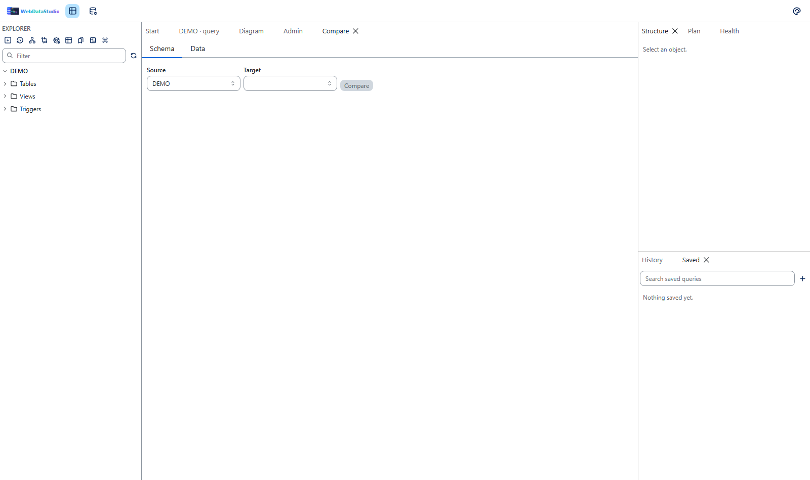

# Comparison

## Schemas

Pick two connections and the comparison lists tables only in the source, tables only in the target,
tables that differ column by column, and tables that match. The sync script that would make the
target look like the source is generated in the target's dialect and shown in a diff editor.

The script is never run from the comparison panel. Copy it into a query tab and read it first —
a sync script contains `DROP` statements.

## Data

Pick two tables and the key columns to match rows by; without a choice the primary key is used.
The comparison walks both sides in key order, so memory stays flat no matter how large the tables
are, and reports rows missing in the target, rows only in the target, and rows that differ with the
changed columns named.

The generated script is `INSERT` for what is missing, `UPDATE` for what differs and `DELETE` for
what is extra.

## Two results

Inside a query tab, the **Compare** view diffs two results you already have on screen — no second
round trip, and no risk of comparing two different points in time.
