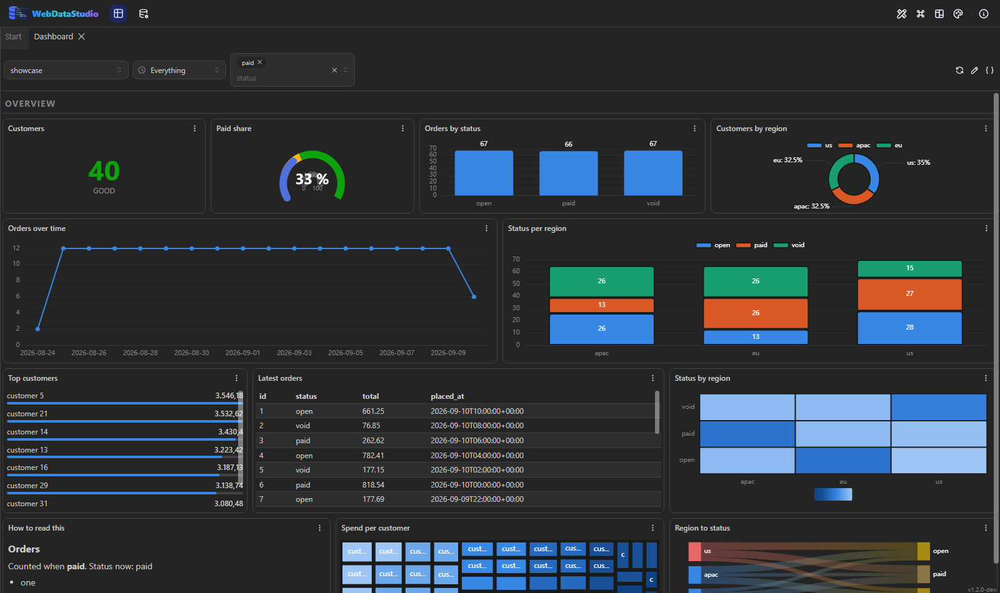

# Dashboards



A dashboard here is a canvas: twenty-four columns, widgets you drag and resize, one time range for
the page, and variables its statements read. **Tools → Dashboard.**

Nothing on it is a second way into the data. A widget's statement runs through the endpoint a query
tab runs through — or through the studio's own [federation](federation.md) when it spans several
connections — so the row cap, masking, read-only connections and the audit line are the same ones,
not a second set with its own bugs.

## The page

View and edit are two modes, and view is the default. The pencil opens the canvas: drag a widget by
its title bar, resize it by its corner, and **Add widget** offers the palette. **Save** keeps it;
the cross throws the draft away.

- **The time range** sits in the header and belongs to the page. In view mode it is your own choice
  for as long as you look at it; in edit mode it is saved with the dashboard as where it starts.
- **Refresh** is seconds, and nothing under ten: a dashboard that reruns every second is a load
  test. Empty means it runs when somebody asks.
- **Every widget's own menu** — the three dots — runs it again, opens its statement in the editor,
  and turns a chart into the rows it was made of. That last one is both the accessibility fallback
  and the fastest way to see why a picture looks wrong.
- A widget that cannot draw says why **in its own frame**. One broken statement never blanks a page.

## The widget types

| The job | Type |
|---|---|
| One headline number | `Stat` — thresholds colour it, and the state is printed as a word too |
| A number against a range | `Gauge` — needs a smallest and a largest, and refuses to draw without them |
| Magnitude per category | `Bar`, `StackedBar` — sideways by itself when the labels are long |
| Change over time | `Line`, `Area`, `StackedArea` |
| A shape, small | `Sparkline` |
| Part of a whole, few parts | `Pie` — at most eight slices, then one "Other" |
| Part of a whole, many parts | `Treemap` — one hue, light to dark by size |
| Density across two dimensions | `Heatmap` — a sequential ramp, never categorical |
| Where the rows are | `GeoMap` — the studio's own map: shapes to scale, no basemap, no tile server |
| Flow from one thing to another | `Sankey` |
| Rows as rows | `Table`, `List` — `List` is a label and a value, for a top ten |
| Prose | `Text` — Markdown, with the variables filled in |
| Structure | `Row` — a band that names a group of widgets |

### What the settings ask

The drawer keeps three questions apart, because they are three questions:

- **Source** — one connection and a statement, a resource path (MongoDB, Redis, OData), or several
  connections at once.
- **Columns** — which column names the things, which measures them, and which turns one value column
  into one series per value. Left empty, the first column that is not a number names the rows and
  every numeric column is drawn: `SELECT status, count(*)` needs no mapping at all.
- **Options** — unit, decimals, a range, a legend, sideways, and thresholds.

There is no second axis to find, on purpose. Two measures at different scales are two widgets, small
multiples, or both indexed to a common base — a chart with two y-scales is the one mistake that makes
a dashboard lie, and it is not available here.

## One widget over several databases

Pick **Several connections** as the source. Each one gets its own statement and an alias; the
widget's own statement then runs over those aliases in DuckDB, exactly as the
[federated panel](federation.md) does — with a row cap per source and an honest report of how much
was copied.

```sql
-- source shop      → alias shop_orders
SELECT to_char(placed_at, 'YYYY-MM-DD') AS day, count(*) AS orders FROM orders GROUP BY 1

-- source warehouse → alias handovers
SELECT CONVERT(char(10), handed_over, 23) AS day, count(*) AS handovers
FROM dbo.deliveries GROUP BY CONVERT(char(10), handed_over, 23)

-- the widget
SELECT coalesce(o.day, d.day) AS day, o.orders, d.handovers
FROM shop_orders o FULL OUTER JOIN handovers d ON d.day = o.day
ORDER BY 1
```

PostgreSQL knows what was ordered and SQL Server knows what was handed to a carrier; the picture is
the question neither can answer by itself.

## The time range, in a statement

The range reaches a widget's SQL through macros, expanded on the server for that engine's dialect:

| Macro | Becomes |
|---|---|
| `$__timeFilter(placed_at)` | this engine's own `BETWEEN` over the range, as bound values |
| `$__from`, `$__to` | epoch milliseconds |
| `$__fromIso`, `$__toIso` | ISO timestamps |
| `$__interval`, `$__intervalMs` | a bucket width from the range and how wide the widget is |

```sql
SELECT date_trunc('hour', placed_at) AS hour, count(*) AS orders
FROM orders
WHERE $__timeFilter(placed_at)
GROUP BY hour
ORDER BY hour
```

`now-24h`, `now-7d`, `now/d` ("since midnight") and an ISO timestamp all work as a range. A macro
this studio does not have is left exactly as it was, and none of them means anything in a query tab —
there, `$__timeFilter` is text somebody typed.

## Variables

**Variables** in the edit header. A variable takes its values from a statement on a connection or
from a written list, stands alone or takes several, and can offer an "All". It appears as a control
in the header and reaches SQL three ways:

| In the statement | What arrives |
|---|---|
| `$region`, `${region}` | the single value, **bound as a parameter** |
| `${region:csv}` | the list, quoted per dialect: `'eu', 'us'` |

**This is a boundary, and it is worth knowing where it runs.** A single value is bound, so it never
becomes part of the statement text and cannot be anything but a value. A list has to be inlined —
no driver binds an `IN` list — so each entry is quoted by the engine's own dialect, and a value
carrying a line break is refused with the variable's name in the message. A dashboard is a document
people paste to each other; it does not get to be a way to run somebody else's SQL.

A `Text` widget interpolates the same variables, so a page can say which region it is about.

## Grafana, in and out

The studio reads Grafana dashboards and writes them.

- **In:** the menu behind `{ }` → **Paste JSON**. Ours, the older tile shape and a Grafana
  dashboard are all recognised without being told which — including an export from their API, with
  its `{ "dashboard": … }` wrapper.
- **Out:** **Export as Grafana JSON**, with `schemaVersion` pinned, ready to paste into theirs.

| Grafana | Here |
|---|---|
| `panels[].type` | `stat`, `gauge`, `timeseries`→`Line`, `barchart`→`Bar`, `piechart`→`Pie`, `table`, `text`, `geomap`, `heatmap`, `row` |
| `gridPos {x,y,w,h}` | the position — both are twenty-four columns, so it is a copy |
| `targets[].rawSql` | the widget's statement; the datasource uid is matched to a connection by name |
| `fieldConfig.defaults` | unit, decimals, min, max, thresholds |
| `options.legend`, `stacking` | legend, and the stacked form of the type |
| `templating.list` | variables |
| `time.from`, `time.to` | the time range |

Neither direction claims to be lossless, and both say what they did. **What cannot come along is a
sentence in the report, not a silently empty widget:** a Prometheus or Loki `expr`, a panel type
nothing here draws (it arrives as a table of its rows), transformations, alert rules, library panels,
annotations. The panel as Grafana wrote it is kept on the widget, so an export puts back the fields
this studio never read.

## What a deployment ships

`WDS_DASHBOARD_FILE` names a file, several files or a folder — and the files may be in any of the
three shapes, mixed:

```bash
-e WDS_DASHBOARD_FILE=/data/dashboards
-v ./grafana-dashboards:/data/dashboards:ro
```

A team with thirteen exported Grafana dashboards has them in exactly that shape: point the setting
at the folder. What each file is gets decided per file, and what could not come along is a line in
the studio's log.

A dashboard that comes with the deployment belongs to it: the studio shows it with a badge and
cannot change or delete it. **Duplicate** makes a copy that is yours.

From an app host, the same two things are
[`WithDashboards`](https://github.com/fgilde/Nextended) with the widget model and
`WithGrafanaDashboards("./dashboards")` — see the Aspire package's README.

## Colour, across twenty-three themes

Charts do not get one palette per theme. They get one validated categorical order in two stepped
sets — one for light surfaces, one for dark — so the same series keeps the same colour wherever it
appears, and both sets clear the colour-vision-deficiency and contrast gates they were checked
against.

What follows from that, and is not adjustable per widget:

- **Colour is assigned in a fixed order and never cycled.** A ninth series folds into "Other"; a
  generated hue would be a colour nobody validated.
- **Two series or more means a legend**, and four or fewer are also labelled directly — identity is
  never carried by colour alone.
- **A magnitude is one hue, light to dark.** A heatmap and a treemap are not sets of categories.
- **The four threshold states are reserved** — good, warning, serious, critical — and never reused as
  "series four". A state is shown with its number, not only as a colour.
- Values, labels and legends wear the theme's own ink; the coloured mark beside them carries the
  identity.

## Not in this

Alerting and notification rules. Annotations. Scheduled PDF or image export — for a file on a
schedule the studio has [scheduled queries](results.md). Live-streaming panels. A datasource that is
not a connection this studio has: no Prometheus, no Loki. A plugin API for third-party widget types.
