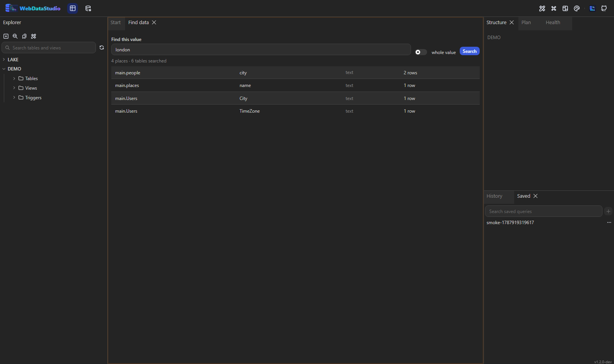

# Verbindungen

## In der Oberfläche anlegen

Oben **Connections** öffnen, **Add** drücken und entweder das Formular ausfüllen oder eine
Verbindungszeichenfolge einfügen — beim Einfügen wird die Engine erkannt und der Rest gefüllt.
**Test** öffnet die Verbindung einmal und meldet, was der Server gesagt hat, ohne etwas zu
speichern.

## Der Objektbaum

Eine Verbindung klappt in Schemas auf, dann Ordner, dann Objekte — und ein Objekt eine Ebene
weiter in seine Spalten, Indizes, Fremdschlüssel und Trigger, jeweils mit Typ oder den Spalten,
die es abdeckt, neben dem Namen.

Ein Rechtsklick zeigt genau das Menü, das zum Angeklickten passt: eine Tabelle bietet Daten,
Designer, Indizes, Skripte und Export; eine Spalte eine Abfrage darauf, einen Index darüber und ein
`DROP COLUMN`-Skript; ein Index Rebuild und Drop; ein Ordner eine neue Tabelle und Neuladen. Was
die Engine nicht kann, fehlt, statt kaputt angeboten zu werden.

Destruktive Statements landen im Abfrage-Tab statt im Menü zu laufen. Ausnahmen sind Datenbank
anlegen, Tabelle anlegen und Index ändern — die haben ihren eigenen Dialog, und jede
Schema-Änderung zeigt ihr SQL trotzdem vor der Ausführung.

### Azure SQL, Synapse und Fabric

Die Liste **Start from** im Formular trägt die Connection-Strings, die sich niemand merkt: Azure SQL
mit Managed Identity, mit dem eigenen Konto oder mit Entra-Passwort; ein Synapse-Pool, serverless oder
dediziert; ein Fabric-Warehouse; die Azure-Datenbankdienste. Ein Preset füllt den Connection-String,
danach ist er wie jeder andere editierbar.

Sagt die Verbindung, dass sich eine Person anmeldet — `Authentication="Active Directory Device Code
Flow"` oder `Interactive` —, versucht das Studio nicht, im Container einen Browser zu öffnen. Es führt
den Device-Code-Flow selbst: die Verbindungsliste markiert sie mit **sign-in**, das Schlüsselsymbol
öffnet einen Dialog mit einem Code, und den gibt man auf einem Gerät mit Browser ein. Das Token bleibt
danach im Speicher des Servers — nie auf Platte, nie im Browser — und die Verbindung öffnet damit, bis
es abläuft.

Eine Managed Identity braucht davon nichts und bleibt überall die bessere Antwort.

Ein Bucket ist auch eine Verbindung: `s3://`, `azblob://`, `gs://` und `file://` öffnen
Objektspeicher im gleichen Baum, wo eine Datei als Tabelle abgefragt werden kann — siehe
[Objektspeicher](storage.md).

## Einen Wert finden statt einer Tabelle

Das Filterfeld findet Objekte. **Find data** — die Lupe in der Werkzeugleiste des Explorers — findet
einen Wert: „welche Tabelle hat 4711 drin?“, serverseitig beantwortet, eine Abfrage je Tabelle und
damit je ein Scan.

Es ist typbewusst, und das hält es schnell: eine Zahl wird gegen numerische Spalten als Zahl
verglichen und in Text gesucht, ein Datum gegen Datumsspalten, und eine Spalte, die den Wert gar nicht
halten kann — `bytea`, Geometrie, ein Bild — wird nie nach Text gecastet. Text wird auf jeder Engine
ohne Groß- und Kleinschreibung verglichen, damit dieselbe Suche auf jeder Verbindung dieselben Zeilen
findet.

Das Ergebnis sagt, wo der Wert steht, in welcher Spalte und wie viele Zeilen ihn tragen — die meisten
Treffer zuerst. Ein Klick öffnet diese Tabelle, schon auf die passende Spalte gefiltert. Außerdem
sagt die Antwort, wie viele Tabellen durchsucht, wie viele übersprungen wurden und warum, und ob sie
am Tabellenlimit aufgehört hat.

## Ist der Server noch da?

Vor jeder Verbindung steht ein Punkt mit dem, was das Studio über sie weiß. Grau heißt „hat noch
niemand gefragt", grün steht für einen Server, der geantwortet hat, rot für einen, der es nicht tat.
Der Tooltip nennt die Dauer der Antwort — oder, wenn keine kam, woran es lag.

Das ist bewusst kein Polling. Ein Studio mit zehn Verbindungen würde zehn davon öffnen, manche durch
einen SSH-Tunnel, für eine Reihe Punkte, die gerade niemand ansieht. Stattdessen fragt es einmal,
wenn eine Verbindung aufgeklappt wird — in dem Moment, in dem jemand Interesse zeigt — und erneut
bei jedem Klick auf den Punkt.

Gemessen wird ein echter Round-Trip, nicht „ein Verbindungsobjekt aus dem Pool existiert": das
kleinste Statement, das die Engine kennt, mit Uhr. Ein grüner Punkt mit gelbem Ring heißt, der
Server hat geantwortet und dafür länger als eine Viertelsekunde gebraucht.

## Nur die Schemas, in denen gearbeitet wird

Ein Server mit fünftausend Tabellen lässt jedes Studio für alle bezahlen: die erste Ebene des Baums,
der Vervollständigungs-Cache, die Objektsuche und der Schema-Snapshot laufen jeweils ab, was sie
bekommen. **Eigenschaften…** einer Verbindung hat dafür die Auswahl **Schemas read** — zwei benennen,
und mehr wird nicht gelesen. Leer heißt alles, und das bleibt die Vorgabe.

Eine Bereitstellung kann es stattdessen festlegen: `WDS_CONN_<NAME>_SCHEMAS=public,sales`; die Auswahl
berichtet das dann, statt Bearbeitbarkeit vorzutäuschen. Gefiltert werden nur Schemas und Datenbanken —
ein Bucket, ein Keyspace oder ein Server-Ordner geht durch, denn ein Schema-Filter, der auf einer
anderen Engine den Baum leert, wäre ein Fehler.

## Eigenschaften

**Properties…** auf einer Verbindung, ihrer Datenbank oder einem Schema zeigt, was diese Verbindung
ist: Name, Engine, wo sie definiert wurde, ob sie nur lesend ist, der SSH-Tunnel falls vorhanden —
und was der Server selbst meldet, etwa Version, aktuelle Datenbank, Kodierung, Zeitzone und Größe.
Unten steht, was die Engine unterstützt; eine fehlende Schaltfläche in der Oberfläche hat damit
einen sichtbaren Grund.

Auch die Verbindungszeichenfolge steht dort, das Passwort durch eine Maske ersetzt. Das Auge zeigt
es, und es gibt zwei Kopier-Schaltflächen: eine kopiert die Zeichenfolge ohne Passwort, die andere
mit. Das Passwort wird nur geholt, wenn eine davon gedrückt wird — es ist nie Teil eines normalen
Seitenaufbaus, und das Aufdecken übersteht das Schließen des Dialogs nicht.

Antwortet der Server nicht, zeigt der Dialog trotzdem die Definition und nennt den Fehler — meist
ist genau das der Grund, ihn zu öffnen.

## Gruppen und Farben

Eine Verbindung kann eine Gruppe und eine Farbe tragen. Der Explorer zeichnet Gruppen als
einklappbare Überschriften und färbt jede Verbindungszeile in ihrer Farbe. Rot für Produktion ist
eine Konvention, die sich lohnt.

## Nur-Lese-Verbindungen

Das Nur-Lese-Flag wird im Treiber geprüft: alles, was kein Lesen ist, wird mit klarer Meldung
abgelehnt, und die Oberfläche blendet die Aktionen aus, die scheitern würden. `WDS_READONLY=true`
erzwingt das für alle Verbindungen zugleich.

## SSH-Tunnel

Im Formular den Abschnitt **SSH tunnel** öffnen und Host, Benutzer sowie Passwort oder privaten
Schlüssel angeben. WebDataStudio öffnet den Tunnel, wenn eine Sitzung ihn braucht, teilt einen
Tunnel zwischen gleichzeitigen Sitzungen und schließt ihn eine Minute nach der letzten.

Host und Port der Datenbank in der Verbindungszeichenfolge bleiben so, wie der Jump-Host sie sieht
— genau dafür ist ein Tunnel da. Lässt sich der Tunnel nicht öffnen, nennt der Fehler SSH und nicht
ein allgemeines Timeout gegen einen Host, den du ohnehin nie direkt erreichen konntest.

## TLS

Der Abschnitt **TLS** schreibt den passenden Schlüssel in die Verbindungszeichenfolge der gewählten
Engine: `SSL Mode` bei PostgreSQL, `SslMode` bei MySQL, `Encrypt` beim SQL Server.
Client-Zertifikate werden über einen Pfad in der Verbindungszeichenfolge referenziert; die Dateien
müssen also für den Container erreichbar sein.

## Import und Export

`GET /api/connections/export` liefert die Definitionen ohne jedes Geheimnis: keine
Verbindungszeichenfolge, kein Passwort, kein Schlüssel. Der Import legt die Verbindungen mit Host
und Datenbank wieder an und lässt die Zugangsdaten leer — eine geteilte Datei kann also kein
Passwort verraten.

## Pooling

Sitzungen werden je Verbindung gepoolt. `WDS_MAX_SESSIONS` begrenzt, wie viele eine Verbindung
gleichzeitig halten darf, `WDS_IDLE_TIMEOUT_SECONDS` entscheidet, wann eine ungenutzte geschlossen
wird. Wird eine Verbindung geändert oder gelöscht, fallen ihre gepoolten Sitzungen sofort weg.
