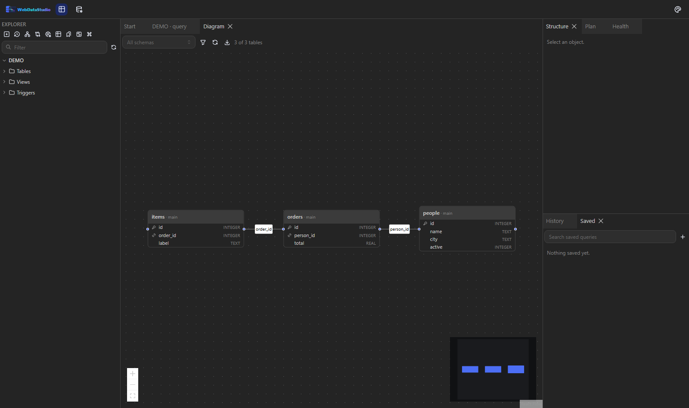

# Diagramme

Die Schaltfläche **Diagram** zeichnet das Schema: eine Box je Tabelle mit ihren Spalten, ein
Schlüsselsymbol am Primärschlüssel, ein Kettensymbol an Fremdschlüsselspalten und eine Kante je
Beziehung, beschriftet mit der Spalte, über die sie verbindet.

- Das Layout entsteht automatisch von links nach rechts: referenzierte Tabellen stehen links von
  denen, die auf sie zeigen. Boxen lassen sich danach verschieben.
- Der Filter wählt, welche Tabellen gezeichnet werden — bei zweihundert Tabellen der Unterschied
  zwischen einem lesbaren Diagramm und einer Wand aus Kästen.
- Die Schema-Auswahl begrenzt das Diagramm auf ein Schema.
- Der Export schreibt ein SVG oder ein PNG von dem, was du siehst.
- Ein Doppelklick auf die Kopfzeile einer Tabelle öffnet ihre Daten.

Das Schema wird einmal gelesen und eine Minute lang zwischengespeichert; die Schaltfläche zum
Neuladen umgeht den Zwischenspeicher.
