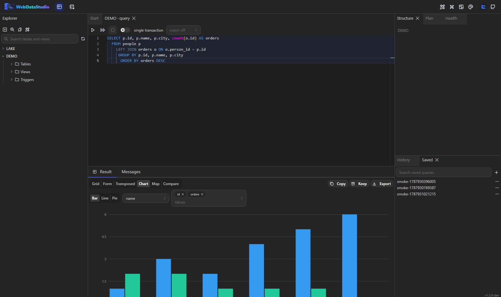

# Ergebnisse und Export

Ergebnisse kommen gestreamt an, noch während die Abfrage läuft — die ersten Zeilen stehen also lange
vor der letzten auf dem Schirm. Das Zeilenlimit (`WDS_MAX_ROWS`, Vorgabe 1000) lässt sich pro Lauf
anheben.

## Ansichten

Ein Schalter über dem Grid wählt, wie dasselbe Ergebnis gelesen wird:

| Ansicht | Gut für |
|---|---|
| Grid | die Vorgabe; virtualisiert, hunderttausend Zeilen scrollen flüssig |
| Form | eine Zeile nach der anderen, wenn eine Tabelle vierzig Spalten hat |
| Transposed | eine breite Tabelle mit wenigen Zeilen — Spalten werden Zeilen |
| Chart | Balken, Linie oder Kreis über eine Beschriftungs- und eine oder mehrere Zahlenspalten |
| Compare | zwei Ergebnisse nebeneinander, über Schlüsselspalten zugeordnet |

## Im Grid

- Sortieren, je Spalte filtern und im ganzen Ergebnis suchen.
- Spalten ausblenden, anheften, verschieben und in der Breite ziehen; Breiten werden je Spaltenname
  gemerkt.
- Nach einer Spalte gruppieren: jede Gruppe zeigt ihre Anzahl und die Summen der Zahlenspalten.
- Zellen markieren, und die Statusleiste zeigt Anzahl, Summe, Mittelwert, Minimum und Maximum.
- Doppelklick auf eine Zelle öffnet den Werteanzeiger: Text, JSON, XML, Hex, Bilder und
  BLOB-Download.
- `NULL` wird anders dargestellt als eine leere Zeichenkette, weil der Unterschied zählt.

## Export

Der Export-Dialog schreibt CSV, TSV, Excel, JSON, NDJSON, XML, YAML, Markdown, HTML, SQL-Inserts,
SQL-Schema und Parquet. Der Umfang ist das aktuelle Ergebnis, eine ganze Tabelle oder ein ganzes
Schema. Trennzeichen, Kodierung, Quoting, Kopfzeile, `NULL`-Darstellung und Datumsformat bestimmst
du.

Exporte streamen: der Server baut die Datei nie komplett im Speicher, eine CSV mit einer Million
Zeilen kostet also so viel Speicher wie eine mit tausend.

## Kopieren

Das Menü **Copy** legt das Ergebnis als CSV, JSON oder Markdown-Tabelle in die Zwischenablage — und
eine Markierung als SQL-`IN`-Liste, der schnellste Weg, eine Menge Ids in die nächste Abfrage zu
bekommen.

## Import

**Import into this table…** im Kontextmenü des Explorers liest CSV, Excel, JSON oder SQL, zeigt eine
Vorschau und lässt dich Dateispalten auf Tabellenspalten abbilden. Fehlerhafte Zeilen werden
einzeln gemeldet, statt die ganze Datei abzubrechen.

**Copy to another connection…** verschiebt eine Tabelle zwischen zwei Verbindungen, auch über
Engine-Grenzen hinweg.

## Eine Tabelle durchsehen

Eine mit Doppelklick geöffnete Tabelle hat dieselben Aktionen **Copy** und **Export** wie ein
Abfrage-Ergebnis: Kopieren nimmt die Seite auf dem Schirm, Export streamt die ganze Tabelle. Die
Spaltenköpfe haben ein Menü zum Sortieren und Filtern, und beides läuft auf dem Server — eine Seite
hält standardmäßig 200 von womöglich Millionen Zeilen, im Browser wäre also die falsche Menge
sortiert. Wie viele es sind, ist eine [Einstellung](shortcuts.md).

## Die Filtersprache

Jedes Spaltenfilter — im Abfrage-Ergebnis wie in der Tabellenansicht — liest eine kleine Sprache
statt einer Teilzeichenkette. Ein einfaches Wort heißt weiter „enthält", was es vorher auch hieß.

| Eingabe | Bedeutung |
|---|---|
| `ada` | enthält `ada` (Text) bzw. ist gleich (Zahl, Datum, Boolean) |
| `^ada`, `$son` | beginnt mit, endet mit |
| `+ada`, `~ada` | enthält, enthält nicht |
| `!^ada`, `!$son`, `!=ada`, `<>ada` | die Verneinungen |
| `=ada` | ist gleich |
| `>10`, `>=10`, `<10`, `<=10` | als Zahl verglichen, bei einer Datumsspalte als Datum |
| `NULL`, `NOT NULL` | kein Wert / ein Wert |
| `EMPTY`, `NOT EMPTY` | kein Wert oder leerer String / keins von beidem |
| `TODAY`, `YESTERDAY`, `TOMORROW` | dieser Tag |
| `THIS WEEK`, `LAST MONTH`, `NEXT YEAR`, … | der Zeitraum; Wochen beginnen am Montag |
| `2026`, `2026-08`, `2026-08-23` | Jahr, Monat, Tag — jeweils der ganze Zeitraum |
| `"zwei Wörter"` | ein Wert mit Leerzeichen, Komma oder führendem Operator |
| `>10 <20` | Leerzeichen ist UND |
| `=1,=2` | Komma ist ODER, und ODER bindet schwächer als UND |

Text wird auf jeder Engine ohne Rücksicht auf Groß- und Kleinschreibung verglichen: PostgreSQLs
`LIKE` unterscheidet sie, MySQLs nicht — dasselbe Filter fand also je nach Verbindung andere Zeilen.

Wie ein Ausdruck gelesen wird, entscheidet der deklarierte Spaltentyp. Ein Wert ist immer ein
Parameter; nichts Getipptes erreicht das SQL als Text. In der Tabellenansicht filtert der Server die
ganze Tabelle, im Abfrage-Ergebnis der Browser die zurückgekommenen Zeilen — beide lesen dieselbe
Sprache, und ein gemeinsames Fall-Korpus (`tests/filter-cases.json`) hält sie ehrlich.

Das Spaltenmenü der Tabellenansicht listet außerdem die **vorhandenen Werte mit ihrer Anzahl** als
Checkboxen, häufigste zuerst. Angehakte Werte landen als `=a,=b` im Filterfeld — eine Art zu tippen,
kein zweites Filter. Eine maskierte Spalte hat keine Liste: ihre Werte sind genau das Geheimnis.

## Karte

Die Ansicht **Map** zeichnet, was an Geografie im Ergebnis steckt: eine Spalte mit GeoJSON (Text oder
Objekt), eine mit WKT (`POINT(13.4 52.5)`, `LINESTRING`, `POLYGON`, auch die `MULTI`-Formen, ein
`SRID=`-Präfix wird ignoriert) oder ein Spaltenpaar aus Breiten- und Längengrad.

Punkte, Linien und Flächen werden maßstäblich gezeichnet, mit den Grenzen der Daten in der Kopfzeile;
Hovern nennt die Zeile. Bewusst **ohne Basiskarte**: ein Container hat keinen Tile-Server, und ein
Datenbank-Studio, das von selbst einen im Internet anfragt, ist nichts, was man still ausliefert. Die
Ansicht beantwortet „liegen die Punkte, wo ich denke, und welcher ist der Ausreißer".

## Archive

Ein Ergebnis lässt sich behalten: **Keep** neben Export schreibt es als Datei auf die Platte des
Studios, das Panel **Archives** listet, was da ist. Das beantwortet „wie sah das vor der Migration
aus" ohne eine zweite Datenbank.

- Die Zeilen werden erneut aus der Datenbank gelesen — ein Archiv ist das ganze Ergebnis, nicht die
  Seite auf dem Schirm.
- Format ist NDJSON: eine Kopfzeile mit Spalten, Zeitpunkt und Herkunft, danach eine Zeile je
  Datensatz als JSON-Array. Das liest jedes Werkzeug.
- Maskierte Spalten sind **in der Datei** maskiert. Ein Archiv davon wäre ein Weg um die Maskierung
  herum.
- Ein vorhandener Name wird ersetzt. **Keep as archive…** auf einer Tabelle im Explorer tut dasselbe
  für eine ganze Tabelle.

Ein geöffnetes Archiv zeigt seine Zeilen in einem normalen Grid. **Script the rows as INSERTs…**
schreibt sie für die Zieltabelle aus — als Skript, das im Editor landet und durch dieselbe Vorschau
geht wie jede andere Änderung. Archive liegen in `archives/` neben der Anwendungsdatenbank oder wo
`WDS_ARCHIVE_DIR` hinzeigt; `WDS_ARCHIVE_MAX_ROWS` (Standard 100 000) begrenzt, wie viele Zeilen
eines behält.

## Verlauf

`Strg+H` öffnet den Verlauf: jedes gelaufene Statement mit Zeitpunkt, Dauer, Zeilenzahl und Fehler.
Er liegt auf dem Server, ein Neustart des Containers verliert ihn also nicht. Ein Klick legt das
Statement zurück in einen Abfrage-Tab.

Ist in den Einstellungen **Keep the result with each history entry** an, behält ein erfolgreicher
Lauf auch, was er zurückgab. Solche Einträge tragen ein kleines Symbol; ein Klick darauf öffnet die
Zeilen von damals in einem normalen Grid, ohne noch einmal etwas auszuführen. Standardmäßig aus, und
das aus gutem Grund: ein Snapshot ist eine Kopie der Daten in der Workspace-Datenbank. Die Zeilenzahl
ist ebenfalls eine Einstellung, und ein Snapshot über einem Megabyte wird abgelehnt statt still
abgeschnitten.
