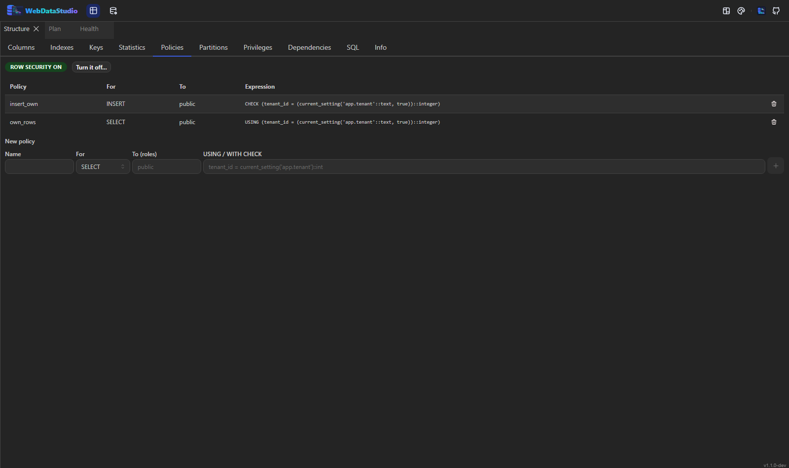
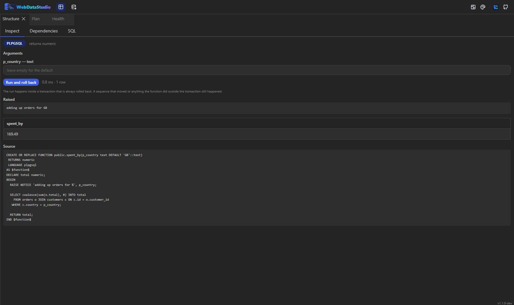
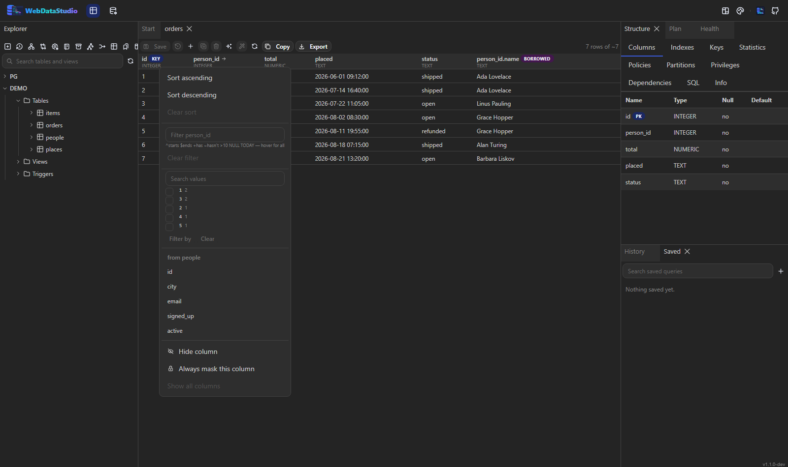
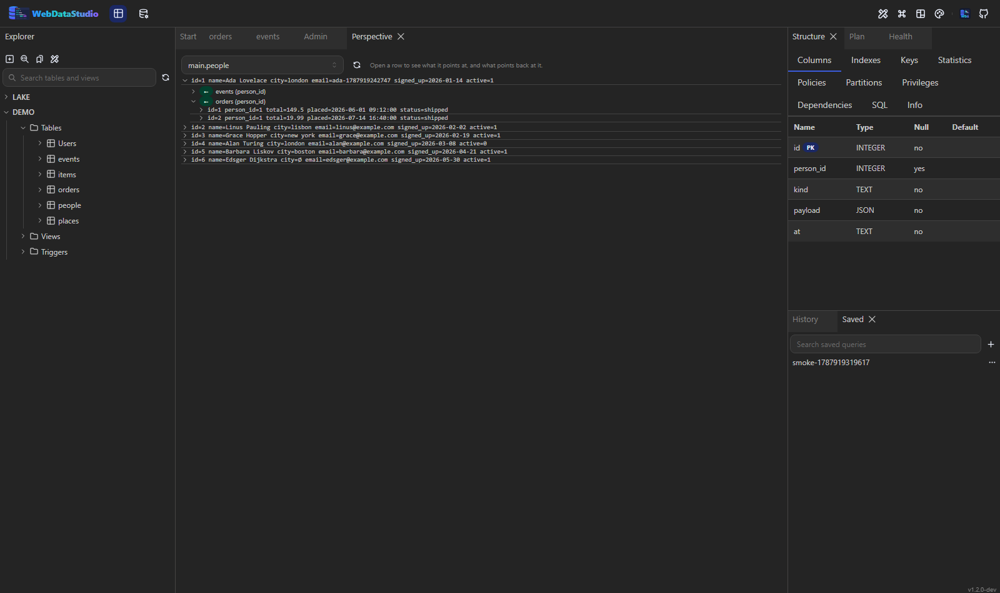

# Schema bearbeiten


## Tabellen-Designer

**Design table…** im Kontextmenü des Explorers öffnet eine Tabelle: Spalten mit Typ, Nullbarkeit,
Vorgabewert, Identity und Kommentar; Indizes mit Eindeutigkeit, Filter und Include-Spalten, wo die
Engine sie kennt; Primärschlüssel, Fremdschlüssel, Unique- und Check-Constraints.

Jede Änderung ist zuerst eine Migrationsvorschau. Der Dialog zeigt die Statements, markiert die
destruktiven und sagt, ob sie in einer Transaktion laufen. Vor dem Anwenden erreicht nichts die
Datenbank.

SQLite kennt kein `ALTER COLUMN`; der Designer schreibt die Folge aus Anlegen, Kopieren, Löschen und
Umbenennen selbst und zeigt sie wie jede andere Änderung in der Vorschau.

## Indizes

**Indexes…** auf einer Tabelle öffnet den Designer auf seinem Index-Tab: Name, Spalten,
Eindeutigkeit, ein partielles Prädikat und Include-Spalten, wo die Engine sie kennt.
**Add index on this column…** auf einer Spalte startet denselben Editor mit dem passenden Index
schon vorbereitet.

Wo die Engine Volltext kennt — PostgreSQL und MySQL — macht der Schalter *Full text* daraus die
jeweilige Schreibweise: ein GIN-Index über `to_tsvector(...)` bei PostgreSQL, ein
`FULLTEXT INDEX` bei MySQL. Überall sonst bleibt der Schalter aus, statt ein Statement zu
schreiben, das scheitern würde.

Auch Index-Änderungen laufen durch dieselbe Vorschau wie jede andere Schema-Änderung.

## Skripte aus dem Kontextmenü

`Script: INSERT`, `UPDATE`, `DELETE` und `TRUNCATE` öffnen einen Abfrage-Tab mit dem fertig
geschriebenen Statement für das gewählte Objekt. Spalten, Indizes und Fremdschlüssel haben eigene:
`DROP COLUMN`, `DROP INDEX`, ein Rebuild, `DROP CONSTRAINT`. Destruktive Statements laufen nie aus
einem Menü — sie landen im Editor, wo du sie liest und selbst `F5` drückst.

## Umbenennen

**Rename…** zeigt das Statement zusammen mit dem, was vom Objekt abhängt. Eine Umbenennung, die
einen View zerlegen würde, ist damit eine Entscheidung und keine Überraschung. Welches Statement es
wird, hängt davon ab, was umbenannt wird: `ALTER VIEW`, `ALTER SEQUENCE`, `ALTER TRIGGER … ON`, auf
SQL Server `sp_rename`. Eine Routine wird über ihre Argumenttypen identifiziert, die der Baum nicht
mitführt — dort sagt das Studio das, statt ein Statement zu schreiben, das keine Engine auflösen
kann.

## Views, Prozeduren, Funktionen, Trigger

**Edit source…** öffnet die Definition in einem Editor, mit dem Text der Engine darin. Beim Speichern
kommt erst das Statement, genau wie beim Tabellen-Designer:

- ein **View** öffnet als sein `SELECT` — das `CREATE` schreibt das Studio darum, denn jede Engine
  buchstabiert „ersetze diese Definition“ anders (`CREATE OR REPLACE` bei PostgreSQL und MySQL,
  `CREATE OR ALTER` bei SQL Server, bei SQLite ein Drop und ein Create, beides sichtbar);
- eine **Prozedur, Funktion oder ein Trigger** öffnet als ganzes Statement — das erwartet zurück,
  wer so etwas geschrieben hat. SQL Server bekommt es als `CREATE OR ALTER`, egal was im Quelltext
  steht, damit das Speichern einer bestehenden Routine nicht an „there is already an object named …“
  scheitert; MySQL kann nicht ersetzen, dort stehen Drop und Create zusammen in der Vorschau.

**New view…**, **New procedure…**, **New function…** und **New trigger…** liegen auf dem Ordner, der
sie hält, und starten mit einer Vorlage statt mit einem leeren Feld.

Ein Trigger lässt sich außerdem **abschalten** statt löschen — `ALTER TABLE … DISABLE TRIGGER`, auf
SQL Server `DISABLE TRIGGER … ON`. MySQL und SQLite können das nicht und sagen es.

## Sequenzen

**Change…** auf einer Sequenz schreibt das `ALTER`: Schrittweite, Minimum, Maximum, Cache, Cycle —
und **Restart**, weswegen man eigentlich kommt. Ein Import, der eigene Ids geschrieben hat, lässt die
Sequenz dort weiterzählen, wo sie war, und der nächste Insert kollidiert; sie über die größte
vergebene Id zu setzen, erledigt das in einem Statement. Ein Restart ist als destruktiv markiert,
denn er kann Ids vergeben, die es schon gibt.

**New sequence…** liegt auf dem Sequenzen-Ordner. MySQL und SQLite haben keine Sequenzen und sagen,
was man stattdessen nimmt (`AUTO_INCREMENT`, `INTEGER PRIMARY KEY`).

## Schemas, Beschreibungen und Löschen

**New schema…** liegt auf der Datenbank, **Drop schema…** auf dem Schema — der Drop fragt, ob alles
darin mitgeht (`CASCADE`), denn das ist die eigentliche Frage. In MySQL ist ein Schema eine
Datenbank, dort verweist das Studio auf **New database…**.

**Description…** schreibt die Beschreibung, die die Datenbank selbst führt (`COMMENT ON`) — das, was
ein anderes Werkzeug an dieser Datenbank sieht. Bei PostgreSQL für Tabellen, Views, Spalten,
Sequenzen und Routinen, bei MySQL für Tabellen. SQL Server führt Beschreibungen als Extended
Properties, SQLite gar keine; dort sind die eigenen [Notizen](../explorer.md) des Studios der Platz
dafür — die brauchen weder Rechte noch Migration.

**Drop…** ersetzt bei jeder Objektart das frühere „Script: DROP“: das Statement steht da, daneben
alles, was von dem Objekt abhängt, und erst ein Klick führt es aus. Denselben Weg nimmt eine
Tabellenänderung — deshalb ist ein Drop, der einen View zerlegen würde, eine Entscheidung und keine
Überraschung.

Die Objekt-Editoren sind ausgeblendet, wo das Studio kein DDL schreibt: PostgreSQL, MySQL, SQL Server
und SQLite haben einen Writer, alles andere nimmt ein Statement im Abfrage-Tab.

## Ein Data Dictionary

**Data dictionary…** im Kontextmenü einer Verbindung schreibt das Dokument, nach dem jemand fragt,
der neu ins Team kommt: eine Markdown-Datei, die sagt, was in dieser Datenbank steht.

- Zuerst eine Übersicht — jede Tabelle mit Zeilenzahl, Größe und wofür sie da ist.
- Dann jede einzeln und vollständig: Spalten mit Typ, Nullbarkeit, Vorgabewert und Kommentar; worauf
  sie zeigt; ihre Indizes.
- Und die **Notizen**, die hier an Objekten hinterlassen wurden. Das ist der Teil, der sich noch nie
  aus dem Schema ableiten ließ — genau deshalb gehört er ins Dokument.

Kopieren oder als `.md` herunterladen. Eine Tabelle zu beschreiben kostet mehrere Round-Trips,
deshalb hört das Dokument nach zweihundert auf und sagt, wie viele es ausgelassen hat, statt so zu
tun, als wäre das alles gewesen.

## Snapshots und Drift

Ist `WDS_SCHEMA_SNAPSHOT_DIR` gesetzt, schreibt das Studio kurz nach dem Start eine Momentaufnahme
des Schemas jeder Verbindung und meldet, was sich seit der letzten bewegt hat: hinzugekommene und
entfernte Tabellen, und je Tabelle, welche Spalten, Indizes und Fremdschlüssel kamen oder gingen.

```bash
WDS_SCHEMA_SNAPSHOT_DIR=/data/snapshots
```

Die erste Momentaufnahme ist eine Grundlinie, keine Änderung; jede weitere ist die Grundlinie der
nächsten. Der Drift steht außerdem im Log und geht als Nachricht raus, wenn
[Alerts](administration.md) konfiguriert sind.

**Die Differenz als Skript.** Der Bericht sagt, was sich bewegt hat; der Knopf daneben sagt, was
dort zu laufen hat, wo es noch nicht passiert ist. Die Statements entstehen aus dem *aktuellen*
Schema und nicht aus der Zusammenfassung des Snapshots — der Snapshot weiß, welche Tabelle sich
geändert hat, die Datenbank weiß, wie sie jetzt aussieht — und sie landen in einem Abfrage-Tab,
statt zu laufen: neue Tabellen so, wie sie sind, neue Spalten, neue Indizes und die Drops für das,
was weg ist.

Eines überlässt es bewusst einem Menschen: eine Spalte, deren Typ oder Nullbarkeit sich geändert
hat. Das steht als Kommentar oben im Skript, denn daraus ein `ALTER` zu machen hieße zu entscheiden,
ob die Daten noch hineinpassen — und eine Migration, die still abschneidet, ist schlimmer als eine
Zeile, die sagt „sieh dir das an“.

Das Panel liegt in **Administration → Schema drift**, mit einem Knopf **Snapshot now** für den
Moment direkt nach einer Migration.

## Was das Struktur-Panel beantwortet

Neben Spalten, Indizes und Schlüsseln beantworten weitere Tabs die Fragen, die man sonst per Hand im
Katalog sucht: **Statistik** (Größe, Zeilen, tote Zeilen, letztes `VACUUM`/`ANALYZE`, jeder Index mit
Größe und Scan-Zahl), **Rechte** (wer was darf, samt `GRANT`/`REVOKE` als Statement),
**Abhängigkeiten** (was zerbricht, wenn sich das hier ändert) und **SQL** (das Objekt als
`CREATE`-Statement).



**Policies** — bei einer Tabelle: ob Row Level Security an ist, ob sie auch für den Eigentümer
erzwungen wird, und jede Policy mit ihrem Ausdruck. Das Feld darunter baut ein `CREATE POLICY`, der
Mülleimer ein `DROP POLICY`. Security an ohne Policy heißt „außer dem Eigentümer sieht niemand
etwas“, und der Tab sagt das auch. Nur PostgreSQL — es ist ein PostgreSQL-Feature, und die anderen
Engines sagen genau das statt nichts zu zeigen.

**Partitionen** — bei einer partitionierten Tabelle: die Strategie (`RANGE`, `LIST`, `HASH`) samt
Schlüssel, jede Partition mit Grenze, Größe und Zeilenschätzung. `DETACH` lässt die Daten als eigene
Tabelle zurück, `ATTACH` nimmt eine bestehende Tabelle auf und braucht die Grenze ausgeschrieben.
Beides sind Statements; *detach concurrently* blockiert keine Leser und läuft dafür nicht in einer
Transaktion.



**Inspect** — bei einer Funktion oder Prozedur: Sprache, Rückgabetyp, deklarierte Parameter, der
Quelltext und ein **Lauf, der zurückgerollt wird**. Argumente eintragen, Knopf drücken: die Funktion
läuft in einer Transaktion, die immer zurückgerollt wird, und es erscheint, was zurückkam, wie lange
es dauerte und jedes `RAISE NOTICE` auf dem Weg.

Kein schrittweiser Debugger: keine Breakpoints, keine Variablen-Inspektion. Für PL/pgSQL deckt es
das ab, was dieses Debuggen praktisch ist. Zwei Dinge muss man wissen: Nebenwirkungen, die
PostgreSQL außerhalb der Transaktion führt — eine weitergezählte Sequenz, ein `dblink`-Aufruf —
überleben das Rollback, und eine schreibgeschützte Verbindung lehnt den Lauf ab, statt so zu tun,
als machte das Rollback ihn sicher.

## Eine Spalte von der anderen Seite des Schlüssels



Das Spaltenmenü der Tabellenansicht bietet die Spalten der Tabelle an, auf die ein Fremdschlüssel
zeigt: eine auswählen, und sie steht neben der Id, markiert als **borrowed**. Der Join passiert auf
dem Server, Sortieren und Filtern gelten weiter für die eigenen Spalten, und die geliehene Spalte ist
schreibgeschützt — eine Änderung dort wäre ein Update auf eine Zeile, die dieses Grid nicht adressiert.

Nur einspaltige Schlüssel: einem zusammengesetzten Schlüssel kann ein einzelner Wert nicht folgen.

## Perspective — eine Zeile und alles, was mit ihr zu tun hat



Das Panel **Perspective** beginnt bei einer Tabelle und lässt eine Zeile aufklappen: worauf sie
zeigt, und was auf sie zeigt, jeweils verschachtelt, so tief wie man öffnet. Es liest denselben
Fremdschlüssel-Graphen, den das ER-Diagramm zeichnet — zu tippen ist nichts.

Jede Ebene ist eine Seite Zeilen, nicht die ganze Tabelle, und jede geöffnete Beziehung ist eine
Abfrage; deshalb sind sie zugeklappt, bis man sie will. Gefolgt wird nur einspaltigen Schlüsseln.

## Objekte des Servers im Baum

Unter einer PostgreSQL-Verbindung stehen neben den Schemas auch **Extensions** (mit Version),
**Rollen** (Superuser und Gruppen markiert), **Tablespaces**, **Publications** und
**Subscriptions** sowie je Schema **Typen und Domains**. Es sind reine Auflistungen: das Studio
benennt, was da ist, statt anzubieten, es zu ändern.

**Privileges on everything here…** auf einem Schema baut ein Skript statt eines Dialogs pro Tabelle:
bei PostgreSQL `GRANT … ON ALL TABLES IN SCHEMA`, dazu `ALTER DEFAULT PRIVILEGES`, wenn auch später
angelegte Tabellen gelten sollen — ohne diese zweite Hälfte ist die Tabelle von morgen nicht
abgedeckt. Ein materialisierter View hat **Script: REFRESH** und **Script: REFRESH CONCURRENTLY**;
concurrently hält ihn währenddessen lesbar und braucht einen Unique-Index.
