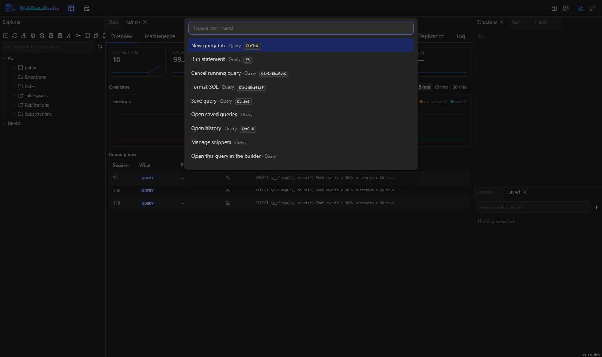
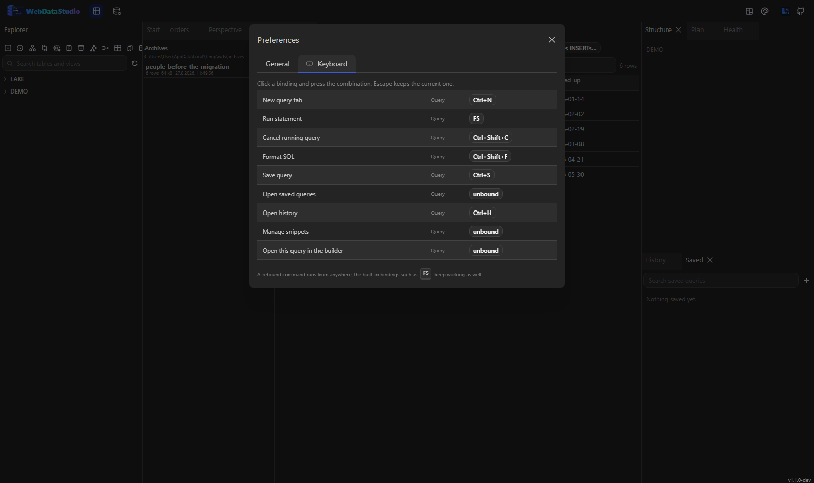

# Tastenkürzel

`?` öffnet dieselbe Liste in der Anwendung, `Strg+K` die Befehlspalette, die jede Aktion erreicht —
auch die ohne Kürzel.

## Abfrage

| Kürzel | Aktion |
|---|---|
| `F5`, `Strg+Enter` | Markierung ausführen, sonst das Statement unter dem Cursor |
| `Strg+Umschalt+Enter` | ganzes Skript ausführen |
| `Strg+Umschalt+C` | laufende Abfrage abbrechen |
| `Strg+Umschalt+F` | SQL formatieren |
| `Strg+N` | neuer Abfrage-Tab |
| `Strg+S` | Abfrage speichern |
| `Strg+H` | Verlauf öffnen |
| `Strg+Leertaste` | Vervollständigung und Snippets |

## Navigation

| Kürzel | Aktion |
|---|---|
| `Strg+K` | Befehlspalette |
| `Strg+Umschalt+O` | Objekt über den Namen finden |
| `F6` | Explorer neu laden |
| `F12` | Objekt unter dem Cursor öffnen |
| `?` | diese Liste |

## Werkzeuge und Ansicht

| Kürzel | Aktion |
|---|---|
| `Strg+D` | ER-Diagramm |
| `Strg+E` | Ergebnis exportieren |
| `Strg+T` | nächstes Theme |
| `Strg+,` | Einstellungen |

## Einstellungen und eigene Kürzel

`Strg+,` öffnet die Einstellungen. Sie liegen im Workspace, überleben also einen Neustart und
begleiten dich in einen anderen Browser, statt in einem Local Storage zu wohnen: Zeilen pro Seite im
Daten-Tab, ob ein Verlaufseintrag sein Ergebnis behält, wie viele Zeilen davon — und ab welcher
Laufzeit eine Abfrage sich meldet, wenn sie fertig ist und du gerade woanders hinsiehst (0 schaltet
das ab; nach der Erlaubnis fragt der Browser erst dann, wenn die erste solche Meldung anstünde).

### Das Theme

`Strg+T` schaltet durch die Themes, die Farbrolle in der Kopfleiste öffnet die ganze Liste mit
Vorschau. Die Wahl gehört diesem Browser — zwei Leute am gleichen Studio können also Verschiedenes
sehen.

Ein Deployment kann sagen, wo es losgeht: `WDS_THEME=nord`, oder
`WithTheme(WebDataStudioTheme.Nord)` in einem [Aspire-Stack](getting-started.md). Das ist ein
Startpunkt, keine Festlegung: die eigene Wahl gewinnt und wird nie überschrieben, ein später
geänderter Deployment-Standard erreicht also weiterhin alle, die nie selbst gewählt haben. Eine Id,
die das Studio nicht hat, wird ignoriert — mit einer Zeile in der Browser-Konsole.

Der Tab **Keyboard** listet jeden Befehl, den die Palette kennt. Bindung anklicken, gewünschte
Kombination drücken, fertig; Escape behält die bisherige, und der Pfeil daneben stellt die
eingebaute wieder her. Ein neu gebundener Befehl läuft von überall aus, und die eingebauten
Bindungen für alles Unangetastete gelten weiter. Modifier stehen in einer festen Reihenfolge
(`Ctrl+Alt+Shift+K`), und auf dem Mac zählt die Command-Taste als `Ctrl`.

Der Editor ist Monaco, seine eigenen Bindungen gelten also auch: Mehrfachcursor mit `Alt+Klick`,
Suchen und Ersetzen mit `Strg+F` und `Strg+H`, reguläre Ausdrücke inklusive.
