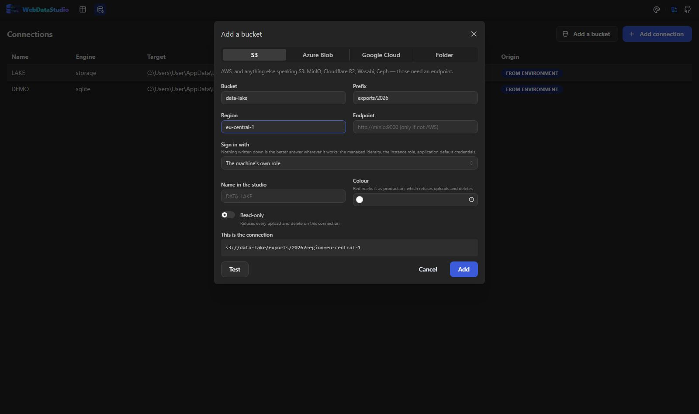
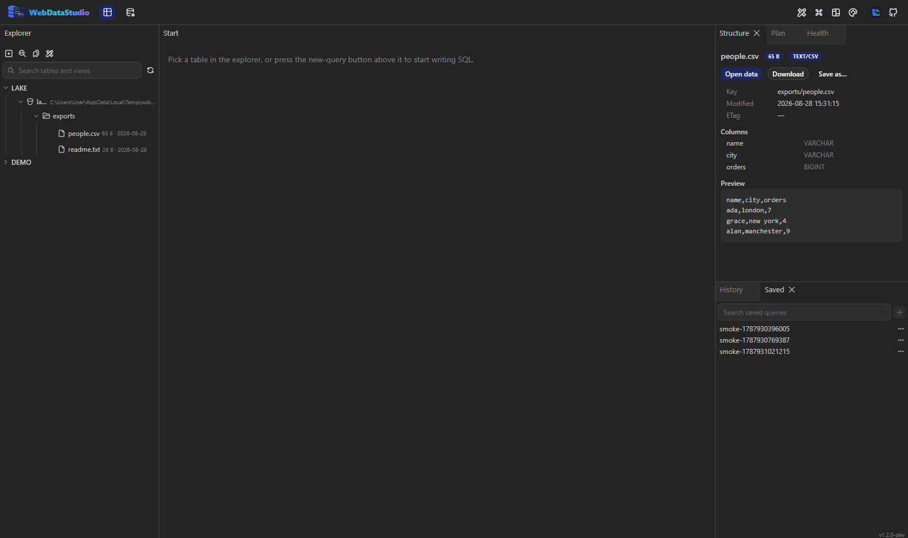
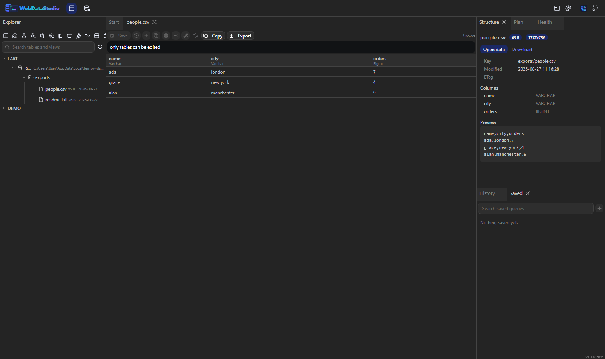

# Objektspeicher

Ein Bucket ist ein Ort, an dem Daten liegen, und bis jetzt konnte das Studio keinen öffnen. Jetzt
schon: ein S3-kompatibler Endpunkt, Azure Blob Storage, Google Cloud Storage oder ein einfacher
Ordner ist eine Verbindung wie jede andere — über `WDS_CONN_*` konfiguriert, aus einem Aspire-AppHost
angehängt, im gleichen Baum durchsuchbar und **abfragbar**, denn eine Parquet-Datei im Bucket ist
eine Tabelle, die zufällig woanders liegt.

## In der Oberfläche anlegen

**Verbindungen → Add a bucket** fragt nach den Bestandteilen statt nach einer URL: Anbieter, Bucket
bzw. Container, optionales Prefix und die Art der Anmeldung — und zeigt die Verbindung, die gespeichert
wird, mit maskierten Geheimnissen.



Das Formular bietet nur an, was ein Anbieter hat: einen Endpunkt für S3 (den MinIO, R2, Wasabi und Ceph
brauchen), ein Konto für Azure, HMAC-Schlüssel für Google. Ein Anbieterwechsel setzt die Anmeldeart
zurück, statt eine falsche mitzunehmen, und was noch fehlt, steht da — nicht bloß ein grauer Knopf ohne
Begründung.

**Test** erreicht den Bucket und listet eine Seite, bevor irgendetwas gespeichert wird: die Antwort
sagt, was drin ist — „reached lake: 3 object(s), 1 folder(s)“ — oder was der Anbieter gemeldet hat.
Eine Storage-Verbindung nur zu öffnen beweist nichts, ein grüner Haken hier heißt also, dass der Bucket
wirklich geantwortet hat.

`Read-only` und eine rote Farbe verweigern danach jeden Upload und jedes Löschen — im Server, nicht in
der Oberfläche.

## Verbinden

Eine Engine-Id, `storage`; das Schema wählt den Anbieter.

```bash
WDS_CONN_LAKE=s3://bucket/prefix?region=eu-central-1
WDS_CONN_EXPORTS=azblob://account/container
WDS_CONN_ARCHIVE=gs://bucket/2026
WDS_CONN_DROP=file:///data/incoming
```

Ein Prefix in der URL begrenzt die Verbindung: `s3://bucket/exports/2026` öffnet dort, und nichts
darüber ist erreichbar.

| Anbieter | Schema | Deckt ab |
|---|---|---|
| S3 | `s3://bucket/prefix` | AWS, MinIO, Cloudflare R2, Wasabi, Ceph — alles mit S3-Endpunkt |
| Azure Blob | `azblob://account/container/prefix` | Azure Blob Storage und Azurite |
| Google Cloud | `gs://bucket/prefix` | Google Cloud Storage |
| Ordner | `file:///data/incoming` | ein Verzeichnis im Container oder auf einem gemounteten Volume |

### Anmeldedaten

Am besten keine. Steht nichts in der URL, nutzt das Studio die Identität, unter der es läuft — eine
Managed Identity in Azure, eine Instanzrolle in AWS, Application Default Credentials bei Google. Eine
Bereitstellung, die einen Zugriffsschlüssel für ihr eigenes Speicherkonto mit sich trägt, trägt ein
Geheimnis, das sie nicht gebraucht hätte.

| Geschrieben als | Bedeutet |
|---|---|
| nichts | die eigene Identität der Maschine |
| `?access=…&secret=…` | S3-Schlüssel |
| `?endpoint=https://minio:9000` | ein S3-kompatibler Endpunkt; adressiert dann über den Pfad |
| `?region=eu-central-1` | die S3-Region |
| `?key=…` | ein Azure-Kontoschlüssel |
| `?sas=…` | eine Azure-Shared-Access-Signature |
| `?connectionstring=…` | ein Azure-Connection-String oder die Blob-Service-URI — der Kontoname steht in beidem drin, die URL muss ihn nicht wiederholen (`azblob:///container?connectionstring=…`) |
| `?credentials=<Service-Account-JSON>` | Google Cloud |
| `?hmac=…&hmacsecret=…` | Google-Cloud-HMAC-Schlüssel, die eine Abfrage braucht — siehe die Grenze unten |

Schlüssel gehören in einen Aspire-Parameter oder in den verschlüsselten Verbindungsspeicher, nie in
eine Compose-Datei, die im Git landet.

## Durchsuchen

Der Baum geht Verbindung → Container → Prefixe und Objekte, und **niemand läuft einen Bucket ab**:
eine Seite wird geholt, wenn jemand einen Knoten öffnet, und nicht vorher; ein Ordner, der länger ist
als eine Seite, endet in einer Zeile, die die nächste holt. Jedes Objekt zeigt seine Größe und den
Tag, an dem es angekommen ist.



Wird ein Objekt ausgewählt, füllt das Strukturpanel sich mit dem, was es ist: Größe, Content-Type,
letzte Änderung, ETag, Speicherklasse, der Anfang des Inhalts als Text, und für alles, was ein Reader
versteht, die Spalten, die es als Tabelle hätte.

**An seinem Platz gezeigt**, statt zum Ansehen heruntergeladen: ein Bild, ein PDF, ein Video, eine
Aufnahme. Ein Dokument, das als eine lange Zeile ankam, wird eingerückt — außer die Vorschau musste
vorher abbrechen, denn ein halbes Dokument ist kein JSON, und es zu formatieren würde das
Gelesene wegwerfen.

Die Vorschau liest den Anfang einer Datei und niemals die ganze — ein versehentlich angeklicktes 4-GB-
Parquet kostet eine Seite, keinen Download. `WDS_STORAGE_PREVIEW_BYTES` legt fest, wie viel (Vorgabe
64 kB). Die Ausnahme sind die Dinge, die an ihrem Platz gezeigt werden: ein Bild oder ein PDF kommt
ganz, denn die Hälfte davon ist kein Bild.

## Eine Datei mitnehmen

**Download** gibt die Datei an den Browser, der entscheidet, wohin sie geht.

**Save as…** fragt vorher. Wo der Browser das kann (Chromium, Edge), wird die Datei direkt an den
gewählten Ort gestreamt und nicht durch den Speicher — ein Parquet mit mehreren Gigabyte ist damit
ein Fortschrittsbalken und kein sterbender Tab; sonst fällt es auf denselben Download zurück. Beides
steht im Kontextmenü des Objekts und über seiner Vorschau.

Die Bytes sind die des Providers — das Studio streamt sie durch und behält nichts.

## Eine Datei abfragen

Doppelklick auf eine Datei oder **Open data**, und sie öffnet sich im Datentab: Sortieren, die
[Filtersprache](results.md), Blättern und Export funktionieren, weil der Treiber auf „woraus lese
ich?“ mit einem Reader über die Datei antwortet statt mit einem Tabellennamen.



| Datei | Gelesen als |
|---|---|
| `.parquet` | `read_parquet` |
| `.csv`, `.tsv`, `.txt` | `read_csv_auto` |
| `.json`, `.ndjson`, `.jsonl` | `read_json_auto` |
| `.gz`, `.zst`, `.bz2` darüber | derselbe Reader; DuckDB packt aus |
| alles andere | nichts — das Menü bietet Vorschau und Download statt einer Abfrage, die scheitern würde |

**Query as table…** auf einem Ordner fragt, welche seiner Dateien zusammengehören (`*.parquet`), und
öffnet das ganze Prefix als eine Tabelle. Das Muster wird gefragt und nicht geraten: ein Ordner voller
CSVs, als Parquet geöffnet, ergäbe nur eine verwirrende Fehlermeldung.

Alles, was das Studio schon kann, gilt dann. Eine maskierte Spalte ist im Grid maskiert, weil die
Maskierung auf Spaltennamen schaut und nie gelernt hat, woher die Zeilen kommen. Das Planpanel zeigt
DuckDBs Plan. `SELECT * FROM read_parquet('s3://…')` in einem Abfragetab ist eine gewöhnliche Abfrage
und kann einen Bucket per [Föderation](../federation.md) mit einer Datenbank verbinden.

Der Datentab ist hier schreibgeschützt und sagt das auch: eine Datei hat keinen Schlüssel, über den
eine einzelne Zeile ansprechbar wäre.

## Etwas ändern

Upload, Löschen und die URI stehen im Kontextmenü, hinter einer Bestätigung.

Beide Verweigerungen sitzen im Server, nicht in der Oberfläche: eine **schreibgeschützte** Verbindung
und eine als **Produktion** (rot) markierte lehnen jeden Upload und jedes Löschen ab — dieselbe Regel,
die schon den Export unmaskierter Spalten aus der Produktion verweigert. Das Lesen bleibt davon
unberührt.

`WDS_STORAGE_MAX_UPLOAD_BYTES` begrenzt einen Upload (Vorgabe 64 MB); alles Größere gehört in das
eigene Werkzeug des Anbieters.

Einen Ordner zu löschen wird nicht angeboten. Das hieße, alles darunter zu löschen, und das ist kein
Klick.

## Ohne Netz

DuckDB liest `s3://`, `az://` und `gs://` über seine Erweiterungen `httpfs` und `azure`, und `INSTALL`
braucht Internet — das ein Container in einem privaten Netz nicht hat. Das Image legt beide
Erweiterungen beim Bauen mit seinem eigenen DuckDB ab, damit die Versionen zwangsläufig passen, und
jede Sitzung lädt sie von dort, mit abgeschaltetem Auto-Install. Etwa 60 MB im Image, und der Preis
dafür, dass Speicher in einem geschlossenen Netz funktioniert.

`WDS_DUCKDB_EXTENSION_DIR` sagt, wo sie liegen (`/opt/duckdb/extensions` im Image). Wo nichts abgelegt
ist — auf einem Entwicklungsrechner — installiert eine Sitzung sie selbst.

## Aus einem Aspire-AppHost

```csharp
var storage = builder.AddAzureStorage("storage").RunAsEmulator();
var exports = storage.AddBlobs("exports");

builder.AddWebDataStudio("studio")
       .WithBlobStorage(exports)                              // jetzt Azurite, später das echte Konto
       .WithStorage("LAKE", "s3://bucket?region=eu-central-1");
```

`WithBlobStorage` nimmt die Blob-Ressource, die der AppHost schon kennt, und gibt deren
Connection-String unverändert weiter: einen Connection-String für den Emulator, die Blob-Service-URI
nach der Bereitstellung — wo das Studio dann seine eigene Managed Identity nutzt. `WithStorage` deckt
alles ab, was der AppHost nicht abbildet. Beide nehmen `readOnly`, `group` und `color`.

## Grenzen, die man kennen sollte

- **Google Cloud und Abfragen.** DuckDB erreicht `gs://` über das S3-Protokoll, das HMAC-Schlüssel
  will. Mit einem Service-Account allein funktionieren Baum, Vorschau und Download; eine Abfrage
  nicht.
- **Listen und Lesen kosten Geld.** Es gibt kein Polling, kein Vorausladen und keinen Hintergrundlauf.
- **Eine Datei ist keine Tabelle.** Kein Bearbeiten, keine Primärschlüssel, kein `UPDATE`.
- **Große Objekte.** Die Vorschau ist begrenzt, der Download streamt.

## Nicht im Umfang

Export **in** einen Bucket, Buckets anlegen, Lifecycle-Regeln, Richtlinien bearbeiten und Kopieren
zwischen Anbietern. Jedes davon ist billig, sobald das hier existiert, und keines ist der Grund,
warum jemand einen Bucket öffnen will.
