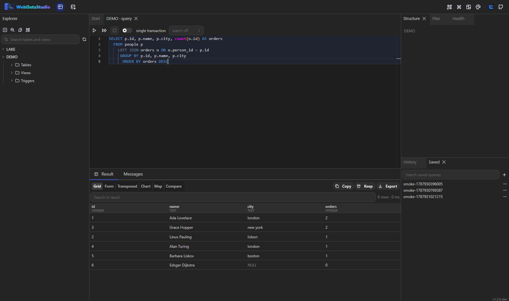

# Query editor



## Running statements

- `F5` or `Ctrl+Enter` runs the selection. With nothing selected, the statement under the cursor
  runs — and that statement is highlighted while you type, so you always see what will run.
- `Ctrl+Shift+Enter` runs the whole script; each statement gets its own result tab.
- The **Cancel** button stops a running statement at the server, not only in the browser.

## Before a statement runs

The studio reads a statement before running it and says what it noticed:

- an `UPDATE` or `DELETE` with no `WHERE` — every row
- a `WHERE` that is always true, so it filters nothing
- `= NULL`, which is never true
- `TRUNCATE` and `DROP`, and what they take with them
- an accidental cross product: a comma-separated `FROM` with nothing joining it, or a `JOIN` with no
  `ON` — `CROSS JOIN` says that on purpose and is left alone

It warns and never refuses. Every one of these is something somebody can legitimately mean, and a
studio that blocked them would only teach people to work around the check, so the dialog says what it
saw and its other button runs the statement anyway. Preferences turn the reading off.

The check is lexical rather than a parser, with comments and string literals blanked first: a
`-- DELETE FROM orders` is a comment, and a `WHERE` inside a literal is not a clause.

## Single transaction

The **single transaction** switch in the toolbar wraps a whole script in one transaction: it
commits when every statement succeeded and rolls back on the first failure. Off, each statement
commits on its own, the way the engine does by default.

## Holding a transaction open

The switch above covers one script. **Begin** covers the other case — the one where you want to see
what a statement did *before* deciding to keep it.

Press **Begin** and the tab holds a transaction open on its own session. Everything the tab runs
from then on happens inside it: the rows are changed for you and for nobody else, and a second
connection still sees the old ones. The toolbar says `transaction · n run` while it is open, and
**Commit** or **Rollback** ends it. That is the seatbelt for `UPDATE` without a `WHERE`: run it,
look at what came back, and roll it back when the number is wrong.

Three things worth knowing:

- The transaction keeps a session out of the pool while it lives, and it holds whatever locks its
  statements took. A transaction nobody touches for fifteen minutes is rolled back by the server —
  `WDS_TRANSACTION_IDLE_SECONDS` moves that line. A browser that is closed outright ends the same
  way, which is better than locks nobody can find.
- Closing the browser tab while one is open asks first.
- Engines without transactions have no Begin button. MongoDB, Redis and object storage are those.

## Keeping going after an error

**keep going on error** runs the rest of the script after a statement fails, and reports each
failure where it happened. Off — the default — stops at the first error, which is what a migration
wants. On is for the script of a hundred inserts where two duplicates should not cost the other
ninety-eight.

Inside a transaction it does not apply: a failed statement poisons the transaction on most engines,
and PostgreSQL refuses everything after it outright, so a transaction always stops.

## Parameters

Write bind variables the way your engine spells them — `:name` for PostgreSQL and Oracle, `@name`
for SQL Server and MySQL, `$name` for SQLite — and a dialog asks for the values before the
statement runs. Values are sent as parameters, never pasted into the SQL, and the last values are
remembered per tab.

A `::text` cast, an `@@version` and a colon inside a string are not parameters and are left alone.

## Completion, hover, go to definition

Completion knows the schema of the connection the tab is bound to: tables, columns behind an
alias, keywords and snippets. Hovering a table name lists its columns; `F12` on one opens it in the
explorer.

## Snippets

Type a prefix and press `Ctrl+Space`: `sel`, `ins`, `upd`, `del`, `join`, `cte`, `idx`, `cnt` are
built in. **Manage snippets** in the command palette opens an editor for your own, which are stored
server-side and travel with your workspace. A snippet of yours with a built-in's prefix replaces it.

### Snippets the deployment ships

`WDS_SNIPPETS_FILE` — or `WithSnippets(...)` from an Aspire app host — puts snippets in everybody's
completion list: the tenant filter your schema needs, written once. They are read-only here, and a
snippet of your own with the same prefix wins for you, the way one of your own wins over a built-in.

## Saved queries and history

Every run is written to a searchable history that survives a restart. The **Saved** panel keeps
named queries in folders; saving offers the current tab's SQL and remembers its connection.

## Saved queries that ship with the stack

`WDS_SAVED_QUERIES_DIR` points at a folder of `.sql` files, imported as saved queries when the studio
starts — the five queries everybody on the team needs, in the repository rather than in a chat
message.

```bash
WDS_SAVED_QUERIES_DIR=/data/queries
```

- Subfolders become the folders in the **Saved** panel.
- A file may name its connection and folder in comments, and still be a file the database accepts:

```sql
-- wds:connection SHOP
-- wds:folder Ops
SELECT count(*) FROM orders WHERE created_at > current_date - 7;
```

- Importing is idempotent: the same file under the same name and folder is replaced, not duplicated,
  so a restart does not grow the list. Editing a query in the studio and restarting brings the file's
  version back — the folder is the source of truth for what it holds.

## What this studio has run

The history answers "what did I run"; the **statistics** panel next to it answers "what do I keep
running, and is it getting slower". Statements are grouped by shape rather than by text: comments,
string literals, numbers and parameter lists are replaced by `?`, so the same query with different
parameters is one row.

Each row carries how often it ran, the fastest, the median and the slowest run, how many rows it
returned, how often it failed — and a trend, which compares the first half of the window with the
second. "Slower than it was" is the sentence somebody actually needs; a mean over a month is not.

It reads the studio's own history, so it is about what people ran **here** — the engine's own
statistics (`pg_stat_statements` and its equivalents) are in the administration panel's *Slow
queries* tab and see everything, including what an application ran.

## Formatting

`Ctrl+Shift+F` formats the buffer in the dialect of the connection.

## Notebooks

*Notebook* in the explorer's toolbar opens a document of cells: SQL cells that run against a
connection of their own with `Ctrl+Enter` and keep their result underneath, and note cells for the
prose that explains why any of it was worth running.

- Saved in the workspace, so it survives a reload and a restart.
- **Markdown in and out.** A notebook copies as Markdown — SQL cells as fenced ```sql blocks
  carrying their connection — and can be replaced from the clipboard, so an investigation can be
  pasted into a pull request or an issue and opened again from there.
- A fence that is not `sql` stays prose, so pasted JSON and shell blocks survive the round trip.
