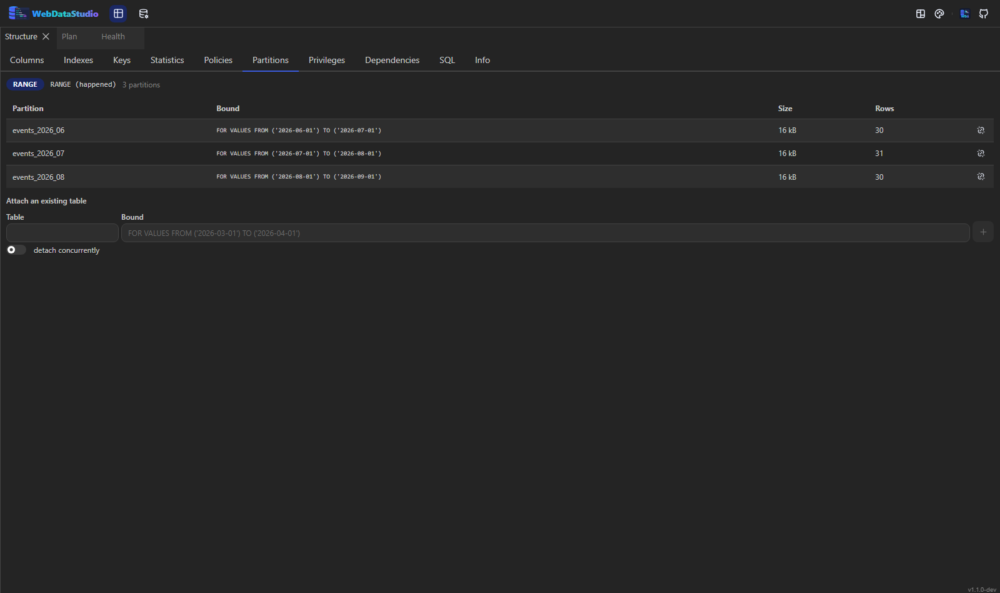

# Explorer and panels

## Searching

The box above the tree searches **tables and views** — the objects people go looking for. Type two
characters or more and the tree is replaced by a flat list of matches, each row showing the
connection and schema it belongs to; empty the box and the tree comes back exactly as it was.

Matching is by subsequence, so `ordit` finds `order_items` and `abpu` finds `AbpUsers`. Results are
ranked: an exact name first, then a name that starts with what you typed, then a match at a word
boundary, then the rest.

A result row behaves like a tree row — click to select, double-click to open the data, right-click
for the same context menu.

> Until this release the box filtered the **first** level of the tree, which is schemas on
> PostgreSQL, folders on SQLite and database numbers on Redis — never tables. Typing a table name
> emptied the tree, and typing `tab` matched the folder called "Tables".

The list comes from the same cached walk the editor's completion and `Ctrl+Shift+O` use, so the
first search on a connection costs one pass over its schema and later ones are instant. The refresh
button drops that cache, which is what to press after somebody else changed the schema.

## Finding a value rather than a table

The filter box finds objects. **Find data** — the magnifier in the explorer's toolbar — finds a
value: "which table has 4711 in it", answered on the server, one query per table and therefore one
scan each.

It is type-aware, which is what keeps it quick: a number is compared against numeric columns as a
number and looked for inside text, a date against dates, and a column that could not hold the value at
all — a `bytea`, a geometry, an image — is never cast to text. Text is matched without case on every
engine, so the same search finds the same rows whichever connection it runs on.

The result says where the value is, in which column, and how many rows carry it, with the most
matches first. Clicking a hit opens that table already filtered on the column that matched. The answer
also says how many tables were searched, how many were skipped and why, and whether it stopped at the
table limit — a search that quietly gave up would be worse than one that says so.

## Only the schemas you work in

A server with five thousand tables makes every studio pay for all of them: the tree's first level, the
completion cache, the object search and the schema snapshot each walk what they are given.
**Properties…** on a connection has a **Schemas read** picker for that — name two, and nothing else is
read. Empty means everything, which stays the default.

A deployment can fix it instead with `WDS_CONN_<NAME>_SCHEMAS=public,sales`; the picker then reports
that rather than pretending to be editable. Only schemas and databases are filtered — a bucket, a key
space or a server-level folder passes through, because a schema scope that emptied the tree on another
engine would be a bug.

## What the tree shows

Under a connection PostgreSQL keeps more than its schemas, and the tree lists that next to them:

| Folder | What is in it |
|---|---|
| Extensions | every installed extension with its version |
| Roles | login roles and groups, superusers marked as such (the `pg_` built-ins are left out) |
| Tablespaces | where the data actually lies |
| Publications / Subscriptions | logical replication, both ends of it |
| Types and domains | per schema: enums, composites and domains |

They are read-only listings — the studio names what is there rather than offering to change it. The
other engines show their schemas as before; a folder they have no catalogue for is left out rather
than shown empty.

## Is this server still there?

A dot in front of every connection says what the studio knows about it. Grey for "nobody has asked
yet", green for a server that answered, red for one that did not — hover it for how long the answer
took, or for what went wrong when it did not come.

It is not a poll. A studio with ten connections would open ten of them, some through an SSH tunnel,
for a row of dots nobody was looking at. Instead it asks once when a connection is expanded — the
moment somebody shows interest in it — and again whenever the dot is clicked.

The reading is a real round trip, not "a pooled connection object exists": the smallest statement
the engine has, timed. A green dot with a yellow ring means the server answered and took longer
than a quarter of a second about it.

## Privileges for a whole schema

**Privileges on everything here…** on a schema builds one script instead of one dialog per table:
the privileges you tick, for the role you name, on every table in that schema. On PostgreSQL that is
`GRANT … ON ALL TABLES IN SCHEMA`, plus `ALTER DEFAULT PRIVILEGES` when "also for tables created
later" is on — without that second half a table created tomorrow is not covered. The other engines
get one statement per table, because that is what they have.

The script opens in a query tab. Nothing changes until it runs there.

## Refreshing a materialised view

Materialised views sit in the **Views** folder next to the ordinary ones, with their own icon and
their own menu — `pg_views` leaves them out, so before this release PostgreSQL never showed one at
all.

A materialised view has **Script: REFRESH** and **Script: REFRESH CONCURRENTLY**. Concurrently keeps
the view readable while it rebuilds and needs a unique index on it; plain is faster and locks it.
Both come back as statements from the server, which knows how the engine spells it — Oracle's is
`DBMS_MVIEW.REFRESH` — and refuses to build one for an object that is not a materialised view.

## A data dictionary

**Data dictionary…** in a connection's context menu writes the document somebody asks for when they
join the team: one Markdown file that says what is in this database.

- An overview table first — every table with its row count, its size and what it is for.
- Then each one in full: columns with their types, nullability, defaults and comments; what it
  points at; its indexes.
- And the **notes** people left on objects here. That is the part that was never derivable from the
  schema in the first place, which is exactly why it belongs in the document.

Copy it, or download it as a `.md`. Describing a table costs several round trips, so the document
stops at two hundred of them and says how many it left out rather than pretending that was all.

## Notes on an object

A database has `COMMENT ON`, which needs a DDL right and a migration — so what somebody learns about a
table ends up in a chat message and is gone by Friday. The **Notes** tab is the studio's own note next
to the object: a name, a date and a sentence, kept in the workspace database with the query history.

Every kind of object has the tab, not only the ones with rows: a function is exactly the thing
somebody needs a sentence about. Notes are searchable across every connection, which is the answer to
"somebody wrote something about this once".

## What a table actually holds

The **Profile** tab counts it. One statement per look: how many rows, how many of them have a value
in each column, how many different values, the smallest and the largest. A column that is unique
without anybody declaring it says so, and so does one that holds the same value in every row —
usually a column somebody forgot to drop.

**What the values look like** is the other half of masking. The mask heuristic reads column *names*:
`api_key` is a secret, `password_changed_at` is a timestamp. That misses `col_17`, so this reads a
sample of the rows instead and matches it against the shapes an email address, an IBAN, a card
number, a phone number, a UUID and a street address have. A card number is checked against its check
digit, which is what keeps a twelve-digit order number from being called one. **Mask this column**
adds it to what the studio hides.

**Rules these numbers suggest** turns what is true today into a rule that says it has to stay true:
a column with no nulls becomes *has a value*, one with no duplicates becomes *no duplicates*, a
number column becomes a range from the values that are there. Each one lands in
[Administration → Data quality](administration.md#data-quality), where it can be changed or switched
off — they are suggestions, not decisions.

A table with more than 60 columns is counted to that point, and the answer says so.

## Dropping a file on the tree

The tree knows what every node is, so a file dragged onto one can go where it obviously belongs —
no dialog asks first, and only the nodes that can take it light up:

| Dropped on | What happens |
|---|---|
| A bucket or a folder in one | The file is uploaded as it is. Several at once are several uploads. |
| A table | The import dialog opens with the file and the table filled in — the column mapping still needs a person. |
| A schema, a table folder or a connection | The file becomes a **new table**: described, previewed and created only after that has been read. |

Everything else takes no files. A view cannot be written to, an index is not a place for rows, and a
column is not a table, so those nodes stay dark and the browser keeps its "no".

## A development subset

"I need production-like data" is usually answered with a full dump: too big to work with and too
dangerous to keep on a laptop. **Development subset…** in a table's context menu answers it
differently.

It takes the rows you ask for — a few hundred, optionally with a `WHERE` — and then **follows the
foreign keys upwards**: the customers those orders belong to, the countries those customers are in.
That is what makes the result loadable; a subset whose foreign keys point at nothing is a text file.
References to *children* are deliberately not followed — "every order for these customers" is a
different and much larger question.

What is about people is replaced: names, addresses, cities, phone numbers, free text. Two rules make
that useful rather than merely safe:

- **Keys are never touched.** Renaming an id would undo the work of following the references.
- **The same value always becomes the same replacement**, so two tables that both name the customer
  still agree. It cannot be turned back — a hash is not a cipher.

Secrets — a column called `api_token`, `password`, `card_number` — are not made plausible. They are
dropped, in a shape the column can still hold.

The answer is one SQL script: `CREATE TABLE` for each table, parents before the tables that reference
them, then the inserts. It opens in a query tab or downloads as a file, and it is exactly what
`WDS_SEED_SQL` loads into a fresh container. What the subset could not do is written into the script
as a comment: a multi-column foreign key it left out, a reference cycle that needs its constraints
deferred, the table cap it stopped at.

Turning the replacement off is allowed and says so, in the dialog and in the script's own header:
that file is real data, and belongs wherever real data belongs.

## Panels

Every panel is a dockview panel: drag it by its tab, drop it anywhere, split the group, and the
arrangement is saved (see [layout presets](shortcuts.md)).

Right-click a tab for:

| Action | What it does |
|---|---|
| Close | closes this panel |
| Close others | closes the other tabs opened during this session |
| Close to the right | the same, for the tabs after this one in the same group |
| Close all | closes every tab opened during this session |
| Pin — keep it open | the tab loses its × and survives all three |
| Maximize / Restore | the group fills the studio, or goes back |
| Open in its own window | the group moves into a separate browser window |

**Closing many at once leaves the furniture standing.** The three closing actions apply to what
was opened during the session — queries, tables, tools. The explorer, the structure and plan side,
the history and saved lists and the start page are the window's own arrangement, and closing them
would mean rebuilding it, which is not what anybody means by closing a dozen query tabs.

Close one of those on purpose and it closes — except the explorer and the start page, which are the
way back to everything else and have no × at all.

### A panel in its own window

"Open in its own window" opens a real browser window, so a popup blocker can stop it — the panel
then stays where it was. The window carries the studio's theme, and closing it docks the panel back
into the studio. A second monitor with the query editor on one side and the result on the other is
what this is for.

## What the structure panel answers

Selecting a table or view fills the structure panel. Beyond its columns, indexes and keys, these
tabs answer the questions people otherwise go looking for in a catalogue by hand:

**Statistics** — how big the object is (total, table, indexes), how many rows the engine thinks it
has, how many of them are dead, when it was last vacuumed and analysed, and how often it is read by
a scan rather than an index. Underneath, every index with its size and its scan count: an index with
**0 scans** that is not a primary key is the clearest "delete me" a database ever gives you.
PostgreSQL, MySQL, SQL Server and Oracle answer this; SQLite keeps no such statistics and the tab
says so rather than showing a table of blanks.

**Privileges** — who has what on this object, and whether they may pass it on. The field above the
list builds a `GRANT`, and the bin next to a row builds the matching `REVOKE`. Neither runs: the
statement opens in a query tab, where it goes through the same preview as any other change. It lists
**grants**, not effective access — an owner and a superuser still reach the object without one.

**Dependencies** — what breaks if this changes, and what this needs. The question before every
`DROP`. On an engine with no dependency catalogue (SQLite) the answer is a search of the other
objects' definitions, and the tab says as much.

**Policies** — on a table, whether row-level security is on, whether it is forced for the owner
too, and every policy with what it applies to and the expression behind it. The field below builds a
`CREATE POLICY`, the bin a `DROP POLICY`. Security that is on with no policy means "nobody but the
owner sees anything", and the tab says so rather than letting it look like an empty list of rules.
PostgreSQL only — it is a PostgreSQL feature, and the other engines say that instead of showing
nothing.

**Partitions** — on a partitioned table, how it is cut up (`RANGE`, `LIST`, `HASH` and the key),
with every partition, its bound, its size and its row estimate. Detaching leaves the data behind as
a table of its own; attaching takes an existing table in and needs the bound spelled out. Both are
statements, and "detach concurrently" is offered because it does not block readers — and cannot run
inside a transaction.

**Inspect** — on a function or procedure: its language, what it returns, its declared parameters,
its source, and a **run that is rolled back**. Fill in the arguments, press the button, and the
studio runs it inside a transaction it always rolls back, showing what came back, how long it took
and every `RAISE NOTICE` it raised on the way.

This is not a stepping debugger: there are no breakpoints and no variable inspection. For PL/pgSQL
it covers what most of that debugging actually is. Two things to know: a side effect PostgreSQL
keeps outside the transaction — a sequence that moved, a `dblink` call — survives the rollback, and
a read-only connection refuses the run rather than pretending the rollback makes it safe.

**SQL** — the object as a `CREATE` statement, to copy or to open in a query tab. Engines that keep
the original text hand that over; for the rest the studio generates it from the shape it read.

## A column from the other side of a key

The column menu of a table browse offers the columns of the table a foreign key points at: pick one
and it appears next to the id, marked **borrowed**. The join happens on the server, so sorting and
filtering still work on the table's own columns, and the borrowed column is read-only — an edit there
would be an update to a row this grid is not addressing.

Only single-column keys are offered. A composite key cannot be followed by comparing one value, and
showing the wrong row would be worse than not offering it.

## Perspective — a row and everything related to it

The **Perspective** panel starts from one table and lets a row be opened: what it points at, and
what points back at it, each as a nested list, as deep as you care to open. It reads the same
foreign-key graph the ER diagram draws, so nothing has to be typed.

Each level is one page of rows rather than the whole table, and each opened relation is one query —
they are collapsed until asked for. Only single-column keys are followed, for the same reason as
above. For paging through a table in full, the data tab is still the right place.

## Query plans

The plan panel reads the plan rather than only drawing it. Besides the heat map over node costs, the
findings list names the shapes that are usually the problem:

| Finding | What it means |
|---|---|
| Sequential scan over many rows | an index on the filtered or joined column turns it into a lookup |
| Nested loop over a scan | the inner side is scanned once per outer row |
| Nested loop over many rows | a hash or merge join is usually the shape for that many |
| Row estimate off by 10× or more | the planner is choosing on stale statistics — `ANALYZE` |
| Sort or hash spilled to disk | it did not get the memory it wanted (`work_mem`, `sort_buffer_size`) |
| Anything the engine itself warned about | passed through as the engine said it |

Each carries the statement that would fix it where there is one, and that statement goes through the
migration preview like everything else.
