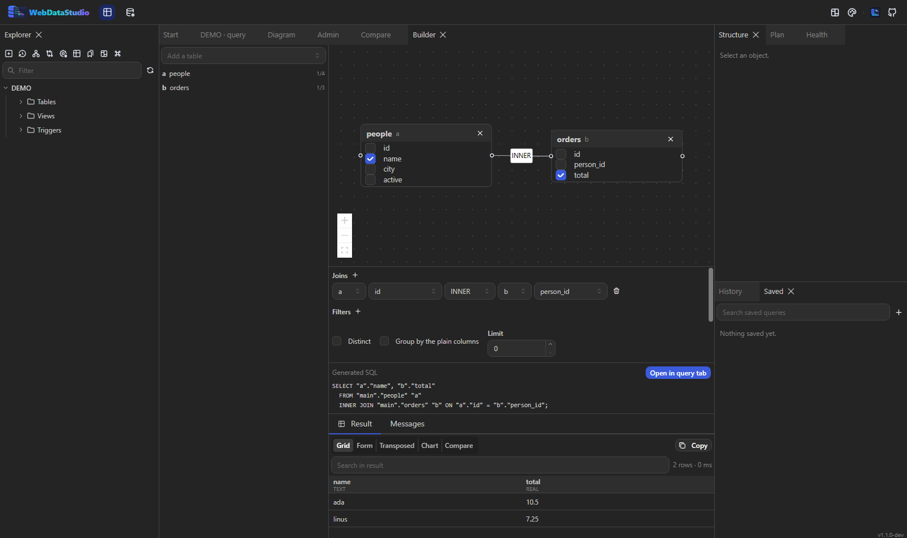

# Query builder

The builder is for the queries you would otherwise write by looking up which column points at
which. It produces plain SQL and hands it to a query tab — nothing it makes needs the builder to
run.



## The canvas

Pick a table from the box on the left and it lands on the canvas as a card. Every column on the
card has a checkbox, and ticking it puts the column in the `SELECT`.

Drag from the handle on one card to another and you get a join. If the schema already knows how the
two relate — a foreign key in either direction — the condition is filled in for you; the tables
`orders` and `people` join on `orders.person_id = people.id` without anybody typing it. Where there
is no key, the first column of each side is a starting point you correct in the join row below the
canvas.

- Double-click a join line to remove it.
- The × on a card removes the table, its joins, its selected columns and its filters.
- Joins, filters and sorting are also editable as exact rows under the canvas — a line can express
  that two tables are joined, not that the condition is `>=`.

## While you build

The generated SQL sits under the canvas, and under that the first 50 rows of it, re-run 400 ms
after you stop changing things. A query that does not run yet shows its error there and nothing
stops working; the canvas is unaffected.

Filter values become bind parameters, never string literals — the builder cannot be talked into
writing an injection for you.

## Aggregates

Give any selected column an aggregate (`count`, `sum`, `avg`, `min`, `max`) and the query becomes a
grouped one: every column without an aggregate moves into `GROUP BY` automatically, because that is
what every engine demands. A `Having` section appears once something aggregates, and its conditions
apply to the aggregate rather than the column.

`Distinct` and `Limit` are next to the grouping switch.

## Getting the query back

"Open in query tab" appends the builder's model to the statement as a comment:

```sql
SELECT "a"."name", SUM("b"."total") AS "spent"
  FROM "main"."people" "a"
  INNER JOIN "main"."orders" "b" ON "a"."id" = "b"."person_id"
 GROUP BY "a"."name";
/* wds:model {"tables":[…],"joins":[…]} */
```

That comment is what lets **Open this query in the builder** (command palette) put the query back on
a canvas. Filter values are deliberately left out of it: the comment travels with the SQL into the
history and into anything you paste it in to.

A statement written by hand carries no such comment, and the builder does not pretend to understand
it — there is no SQL parser behind this, and a half-working one would be worse than the honest limit.
