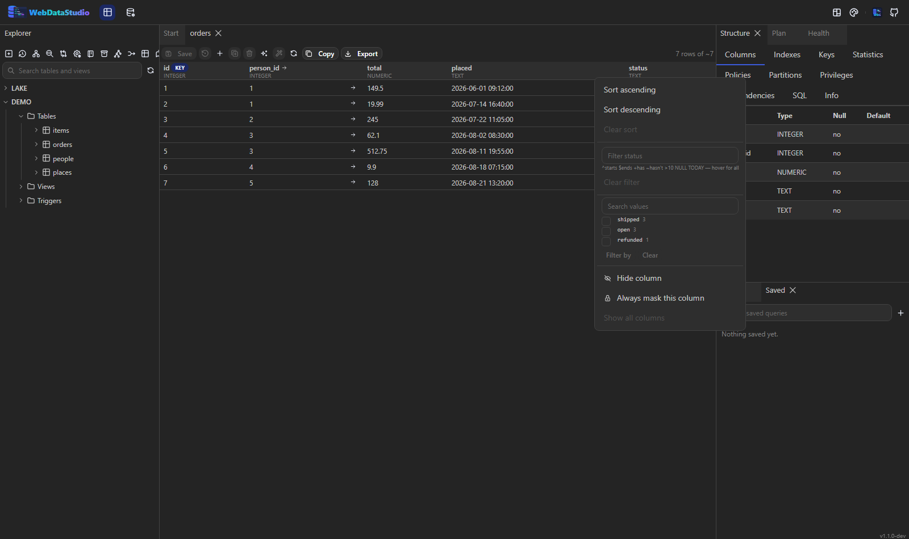
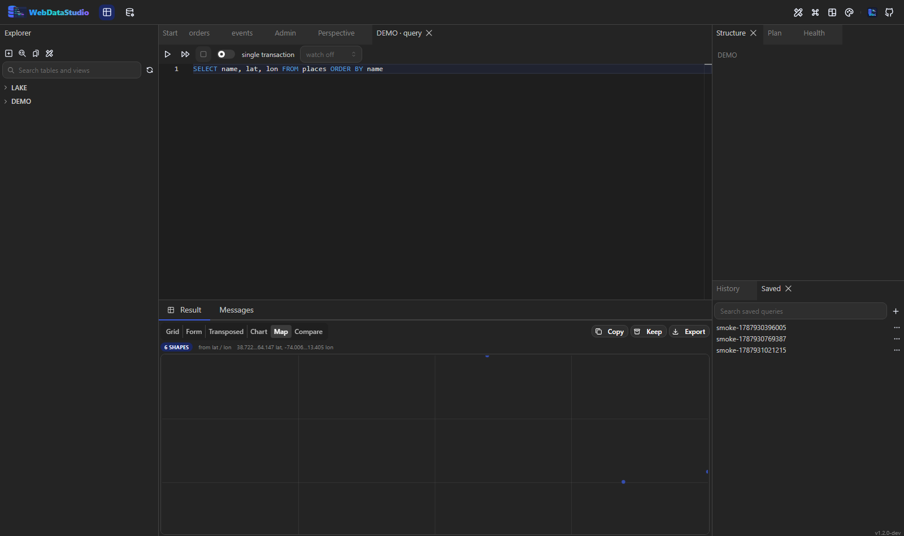
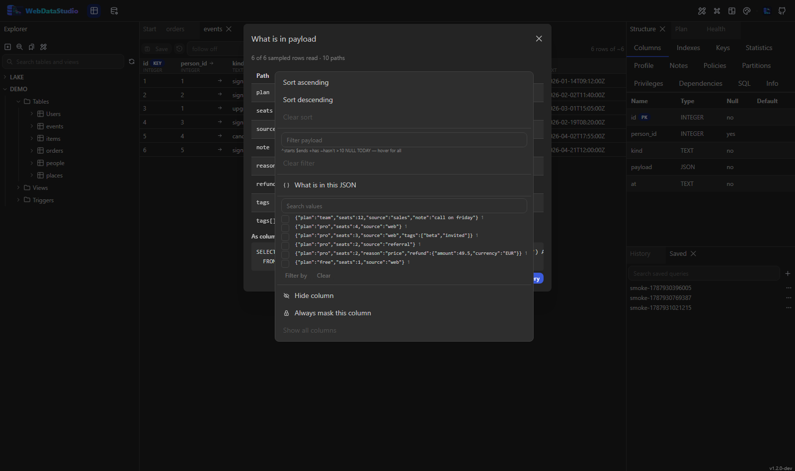
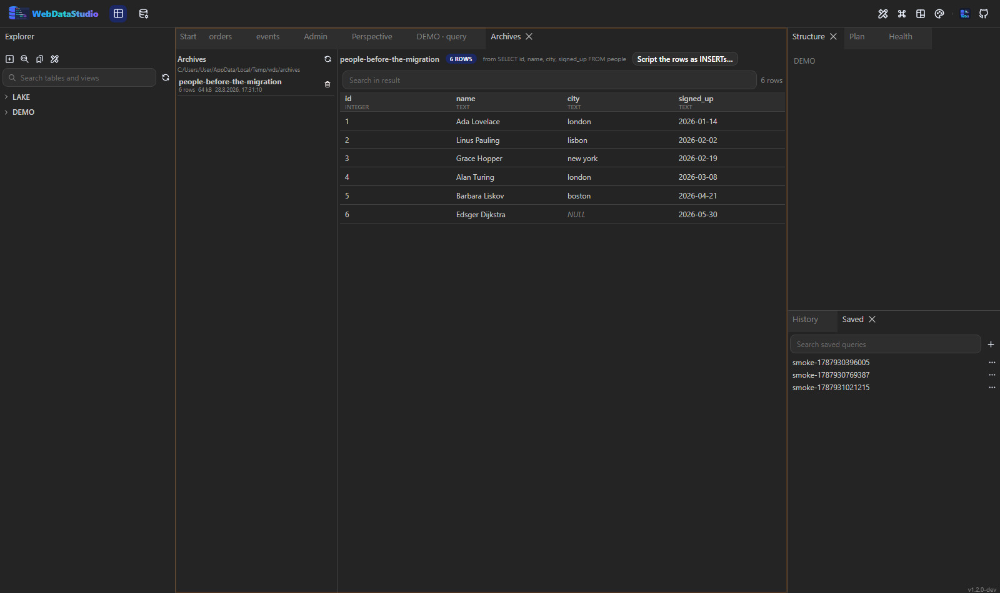

# Results and export

Results stream in while the query is still running, so the first rows are on screen long before the
last one arrives. The row cap (`WDS_MAX_ROWS`, default 1000) can be raised per run.

## Views

A switch above the grid picks how to read the same result:

| View | Good for |
|---|---|
| Grid | the default; virtualised, so a hundred thousand rows scroll smoothly |
| Form | one row at a time when a table has forty columns |
| Transposed | a wide table with few rows — columns become rows |
| Chart | bar, line or pie over one label column and one or more numeric columns |
| Map | geography drawn to scale — see [Geography](#geography) |
| Compare | two results side by side, matched by key columns |


## In the grid

- Sort, filter per column (in the [filter language](#the-filter-language)), and search the whole
  result.
- Hide, pin, reorder and resize columns; widths are remembered by column name.
- Group by a column: each group shows its count and the sums of the numeric columns.
- Select cells and the status bar shows count, sum, average, minimum and maximum.
- Double-click a cell to open the value viewer: text, JSON, XML, hex, images and BLOB download.
- `NULL` is drawn differently from an empty string, because the difference matters.

## The filter language



Every per-column filter box — in a query result and in a table browse — reads a small language
rather than a substring. A plain word still means "contains", which is what it meant before and what
most people type.

| Typing this | Means |
|---|---|
| `ada` | contains `ada` (text) or equals it (a number, a date, a boolean) |
| `^ada`, `$son` | starts with, ends with |
| `+ada`, `~ada` | contains, does not contain |
| `!^ada`, `!$son`, `!=ada`, `<>ada` | the negations |
| `=ada` | equals |
| `>10`, `>=10`, `<10`, `<=10` | compared as a number, or as a date on a date column |
| `NULL`, `NOT NULL` | there is no value / there is one |
| `EMPTY`, `NOT EMPTY` | no value or the empty string / neither |
| `TODAY`, `YESTERDAY`, `TOMORROW` | that day, in the browser's own timezone |
| `THIS WEEK`, `LAST MONTH`, `NEXT YEAR`, … | the period, with weeks starting on Monday |
| `2026`, `2026-08`, `2026-08-23` | a year, a month, a day — each the whole period |
| `"two words"` | a value with a space, a comma or a leading operator in it |
| `>10 <20` | a space is AND |
| `=1,=2` | a comma is OR, and OR binds looser than AND |

Text is compared without regard to case on every engine. PostgreSQL's `LIKE` is case-sensitive and
MySQL's is not, so before this the same filter found different rows depending on which connection it
was typed into.

How a term is read depends on the column's declared type: `>10` on a number is arithmetic, on a text
column it is alphabetical, and `TODAY` only means anything on a date. A value is always a parameter —
nothing typed into a filter box reaches the SQL as text.

In a table browse the filter runs on the server, so it filters the whole table rather than the page
on screen. In a query result it runs in the browser over the rows that came back. Both read the same
language, and a shared corpus of cases keeps them honest about it
(`tests/filter-cases.json`).

### The values a column holds

The column menu in a table browse also lists the column's **distinct values with their counts**, most
common first, as checkboxes — the Excel-style filter. Ticking values writes them into the filter box
as `=a,=b`, so it is a way of typing rather than a second kind of filter, and it can be edited
afterwards. A masked column has no list: the distinct values of a column of secrets are the secrets.

## Geography



The **Map** view draws whatever geography is in the result:

- a column of GeoJSON, as text or as an object,
- a column of WKT — `POINT(13.4 52.5)`, `LINESTRING`, `POLYGON` and their `MULTI` forms, with an
  `SRID=` prefix ignored,
- or a pair of columns called latitude and longitude.

Points, lines and polygons are drawn to scale, with the bounds of the data on the label above and a
grid behind them; hovering a shape says which row it is.

There is deliberately **no basemap**. A container has no tile server, and a database studio that
reaches out to one on the internet by itself is not something to ship quietly. What the view is for
is "are these points where I think they are, and which one is the outlier" — for a map with
coastlines on it, export the rows and open them in something that has a tile budget.

## Export

The export dialog writes CSV, TSV, Excel, JSON, NDJSON, XML, YAML, Markdown, HTML, SQL inserts,
SQL schema and Parquet. The scope is the current result, a whole table or a whole schema. Delimiter,
encoding, quoting, header row, `NULL` representation and date format are all yours to set.

Exports stream: the server never builds the whole file in memory, so a million-row CSV costs the
same memory as a thousand-row one.

### Templates of your own

**Templates…** in the export dialog writes an export format: an id, a name, a file extension, a
content type, and up to three pieces of text.

| Placeholder | Is |
|---|---|
| `{{table}}` | the table or the export's name |
| `{{columns}}` | the column names, joined |
| `{{values}}` | the row's values, joined |
| `{{col.name}}` | one column by name |
| `{{index}}` | the row number, from one |
| `{{comma}}` | a comma on every row but the last |

Each takes a filter for the escaping that format needs: `{{values|sql}}`, and `json`, `csv`, `html`,
`upper`, `lower`. So an `INSERT` writer is three lines:

```
header: INSERT INTO {{table}} ({{columns}}) VALUES
row:      ({{values|sql}}){{comma}}
footer: ;
```

DataGrip calls these extractors and writes them in Groovy, which makes an export format a program the
studio would have to run. These are text, and there is nothing in them to execute. A template saved
here belongs to this studio; `WDS_EXPORT_TEMPLATES_DIR` mounts a folder of them for a deployment, and
those are read-only in the UI — a copy under another id is the way to change one.

## Copy

The **Copy** menu puts the result on the clipboard as CSV, JSON or a Markdown table, and a
selection as a SQL `IN` list — the fastest way to move a set of ids into the next query.

## Import

**Import into this table…** in the explorer's context menu reads CSV, Excel, JSON or SQL, shows a
preview, and lets you map file columns to table columns. Rows that fail are reported one by one
rather than aborting the whole file.

**Copy to another connection…** moves a table between two connections, including across engines.

**New table from a file…** is the other import: the one for a CSV somebody was sent, where there is no
table yet. Pick the file — an upload, or an object in a [bucket](storage.md), which is read where it
lies — and the studio describes it first: the columns it found, the type each one becomes on the
target engine, ten rows as they will arrive, and the `CREATE TABLE` itself. Nothing is created until
that has been read. Parquet, CSV, TSV, JSON and NDJSON are understood, and a whole prefix of files
with the same shape counts as one table.

## Watching a query

The interval box in the query toolbar re-runs the statement every 2, 5, 10 or 30 seconds and
highlights the cells that changed since the previous run, with a note saying what moved — "2
changed, 1 added, 1 gone".

- One run at a time: the next is scheduled when the previous finished, so a slow query cannot pile
  up behind its own interval.
- An error stops the watch and says why, rather than retrying into the same wall.
- Editing the SQL restarts the comparison: watching a query you have since changed would compare
  the wrong things.
- The highlight is skipped while the grid sorts or filters, because then a row's position is no
  longer the row the comparison was about.

## What is inside a JSON column

A JSONB column is one cell of text in the grid, and reading one row of it is a guess. **What is in
this column?** in a JSON column's header menu reads a sample of the documents and answers with the
shape: which paths exist, how often each one is present, which types it holds, and an example value.

Paths are ordered by depth and then by where they were first seen, so the shape reads like the
document rather than like an alphabetical list. Each path carries the expression that reads it **on
this engine** — `->>`, `JSON_VALUE`, `json_extract_string` — so nothing has to know one engine's
spelling from another's, and there is one **Flatten** statement that turns the value paths into
columns, ready for a query tab. Arrays and objects are left out of that statement: a column cannot
hold a subtree.



Sampling is the honest part of this. The report says how many documents it read and how many of them
parsed; a column with a hundred shapes in it will say so rather than presenting the first one as the
truth.

## Following a table

A table that is being written to can be watched from the data tab: pick a key column — an id, a
timestamp, an auto-increment — an interval, and the page re-reads itself in that order with the newest
first. **Rows that arrived since the last read are tinted**, so an insert is visible without diffing
two screenshots.

Only key columns are offered. Ordering by a foreign key and calling the result "newest" would be a
lie the tint makes convincing, so the list is restricted to what actually counts up.

## Browsing a table

A table opened with a double-click gets the same **Copy** and **Export** actions as a query result:
copy takes the page on screen, export streams the whole table. Its column headers carry a menu for
sorting and filtering, and both run on the server — a page holds 200 of possibly millions of rows,
so sorting in the browser would order the wrong set. How many rows a page holds is a
[preference](shortcuts.md#preferences-and-rebinding).

## History

`Ctrl+H` opens the history: every statement that ran, with when, how long it took, how many rows it
returned and the error if it failed. It lives on the server, so a container restart does not lose it.
Clicking an entry puts the statement back in a query tab.

### Result snapshots

With **Keep the result with each history entry** on in the
[preferences](shortcuts.md#preferences-and-rebinding), a successful run also keeps what it returned.
Those entries carry a small icon; clicking it opens the rows as they were then, in a normal grid,
without running anything again. It is the answer to "it returned something different this morning".

It is off by default and worth knowing why: a snapshot is a copy of the data in the workspace
database. The number of rows kept is a preference too, a snapshot larger than a megabyte is refused
rather than silently cut, and a result cut off at the row limit says so when it is reopened.

## Sharing a result

With sharing on, a result grows a **Share** button: the rows are kept as they are and you get a link
to them. It is the answer to "here is what I am seeing" that is not a screenshot.

| Variable | Meaning |
|---|---|
| `WDS_SHARE_ENABLED` | `true` allows sharing. Off by default |
| `WDS_SHARE_PUBLIC` | `true` lets anybody with the link open it, without signing in |
| `WDS_SHARE_TTL_HOURS` | how long a link lives, default `168` (a week) |
| `WDS_SHARE_MAX_ROWS` | rows a link keeps, default `1000` |

A link is a **snapshot**, and that is the whole design:

- It shows the rows as they were. Changing the table afterwards does not change the link, and the
  link cannot run anything.
- It cannot show more than the person who made it could see: masking is applied **before** the rows
  are stored, so a masked column is masked in that link for good.
- Only a reading statement can be shared.
- It expires. An expired link and one that never existed answer the same way, because a link that
  used to work should not say what it used to show.
- Ids are 128 random bits: a link anybody with it can open must not be a link anybody can guess.

`WDS_SHARE_PUBLIC=true` is the part worth thinking about — it puts those rows behind nothing but the
URL. Off, a link still needs an account on the studio.

## Archives



A result can be kept: **Keep** next to Export writes it to a file on the studio's own disk, and the
**Archives** panel lists what has been kept. It answers "what did this look like before the
migration" without a second database to put it in.

- The rows are read from the database again, so an archive is the whole result rather than the page
  on screen.
- The format is NDJSON: a header line naming the columns, when it was written and where it came
  from, then one row per line as a JSON array. Anything can read it.
- Masked columns are masked **in the file**. An archive of them would be a way around the masking.
- A name that already exists is replaced.
- **Keep as archive…** on a table in the explorer does the same for a whole table.

Opening an archive shows its rows in a normal grid. **Script the rows as INSERTs…** writes them out
for whichever table they should end up in next — as a script, which goes to the editor and through
the same preview as any other change.

Archives live in `archives/` next to the application database, or wherever
`WDS_ARCHIVE_DIR` points; `WDS_ARCHIVE_MAX_ROWS` (default 100 000) caps how much one archive keeps.

## Scheduled queries

`WDS_SCHEDULE_FILE` points at a JSON file of queries the studio runs on its own and writes as files —
the nightly report nobody wants to remember to run.

```bash
WDS_SCHEDULE_FILE=/data/schedule/schedule.json
WDS_SCHEDULE_OUTPUT_DIR=/data/exports          # the default
```

```json
[
  {
    "name": "orders-per-day",
    "connection": "SHOP",
    "sql": "SELECT date(created_at) AS day, count(*) FROM orders GROUP BY 1 ORDER BY 1",
    "dailyAtUtc": "03:00",
    "format": "csv"
  },
  {
    "name": "queue-depth",
    "connection": "SHOP",
    "sql": "SELECT count(*) FROM jobs WHERE state = 'pending'",
    "everyMinutes": 15,
    "format": "json"
  }
]
```

- **Reading only.** A scheduled statement goes through the same guard the MCP `run_query` tool uses,
  so a schedule file cannot become a way to run a `DELETE` at 03:00 every night.
- **`everyMinutes` or `dailyAtUtc`**, not cron: the studio is not a scheduler, it runs a report.
- Masking applies — a file is a file that leaves the machine.
- The file is re-read every minute, so editing the schedule needs no restart.
- `GET /api/schedule` reports the jobs and what each last did; `POST /api/schedule/{name}/run` runs
  one now. A failed run is a message when [alerts](administration.md#alerts) are configured.

## A saved query as a form

Saved queries, bind parameters and shared links each existed on their own. **Reports** is the shape
somebody who does not write SQL can use: pick the report, fill in the boxes, press run.

A saved query becomes a report as soon as it names a connection, and the boxes are the bind
parameters it already had — `:from` and `:to` on PostgreSQL and Oracle, `$from` on SQLite and DuckDB,
`@from` on SQL Server and MySQL, the same markers the editor offers.

**The link carries the values.** `/report/<id>?from=2026-06-01&to=2026-06-30` runs by itself when it
is opened, so "the numbers for last month" is something to send rather than something to explain.
*Copy link* writes it, and *Download CSV* takes the answer away.

Reading only, whatever the saved query says: a report is pressed by people who are not reading the
SQL, so one that changes data is refused with that sentence rather than run. It is behind the same
login as the rest of the studio, and masked columns stay masked.
