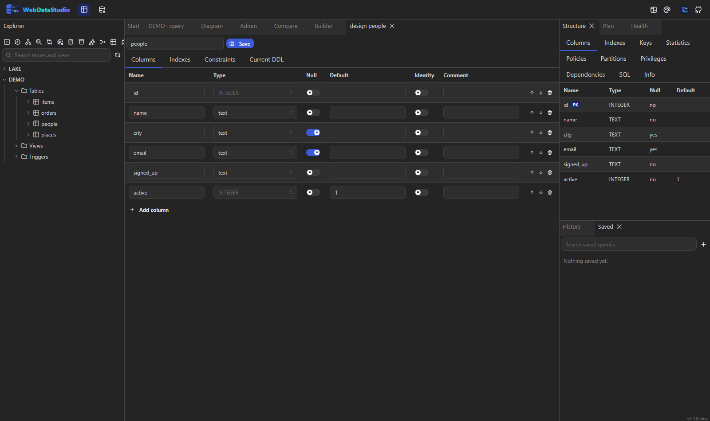

# Schema editing

## Table designer

**Design table…** in the explorer's context menu opens a table: columns with types, nullability,
defaults, identity and comments; indexes with uniqueness, a filter and include columns where the
engine supports them; primary keys, foreign keys, unique and check constraints.

Every change is a migration preview first. The dialog shows the statements, marks the destructive
ones, and says whether they run in one transaction. Nothing reaches the database until you apply.

SQLite has no `ALTER COLUMN`; the designer writes the create-copy-drop-rename sequence for you and
shows it in the preview like any other change.

## Indexes

**Indexes…** on a table opens the designer on its index tab: name, columns, uniqueness, a partial
predicate and include columns where the engine has them. **Add index on this column…** on a column
starts the same editor with that index already filled in.

Where the engine has full text — PostgreSQL and MySQL — a *Full text* switch turns the index into
the engine's own spelling of it: a GIN index over `to_tsvector(...)` on PostgreSQL, a
`FULLTEXT INDEX` on MySQL. Everything else keeps the switch hidden rather than writing a statement
that would fail.

Index changes go through the same preview as any other schema change.

## Scripts from the context menu

`Script: INSERT`, `UPDATE`, `DELETE`, `TRUNCATE` and `DROP` open a query tab with the statement
already written for the object you picked. Columns, indexes and foreign keys have their own:
`DROP COLUMN`, `DROP INDEX`, a rebuild, `DROP CONSTRAINT`. Destructive statements are never run from a menu — they
land in the editor, where you read them and press `F5` yourself.

## Rename

**Rename…** shows the statement together with what depends on the object, so a rename that would
break a view is a decision rather than a surprise.

## Views, procedures, functions, triggers

Their source is shown and can be edited where the engine exposes it. The same preview-then-apply
rule holds.
